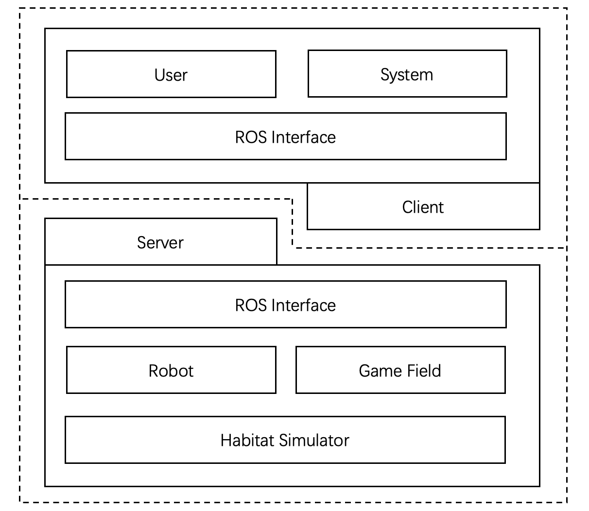

# ICRA-RM-Sim2Real

The official website of the competition: 
- https://air.tsinghua.edu.cn/robomaster/sim2real_icra22.html

The gitee mirror of this repo is provided for mainland user:
- https://gitee.com/RMUS/ICRA-RM-Sim2Real/
## ICRA-RM-Sim2Real Tutorials

Non-Beginners: If you're already familiar enough with Linux+ROS+Habitat or earlier versions and only want to explore the new ICRA-RM-Sim2Real playground, you can go through the detail of installation guide [here](./README_CN.md). However, going over all basic Beginner Level tutorials is still recommended for all users to get exposed to new features.

If you are new to Linux: You may find it helpful to first do a quick tutorial on common command line tools for linux. A good one is [here](http://www.ee.surrey.ac.uk/Teaching/Unix/).

Hardware requirement: NVIDA GPU 1080+ with driver 470+ in need to support the SIM2REAL environment.

Ubuntu 18.04 or later in need to support more convenient experience.

# Core Sim2Real Tutorials

## Entry Level

- the system architecture
  - hardware introduction
  - [software stack](./Tutorial.md)
    - [Habitat](https://github.com/facebookresearch/habitat-sim)
    - [ROS](http://wiki.ros.org/ROS/Tutorials)
      <!-- - briefly introduction
      - SLAM -->
    - [ROS-X-Habitat](https://github.com/ericchen321/ros_x_habitat)
    - [Getting Started with the RoboMaster SDK - EP](https://robomaster-dev.readthedocs.io/en/latest/python_sdk/beginner_ep.html)
- [Installing the system](./docker_sim2real/sim2real-install-guide.md)
- [Related ROS topics](./Tutorial.md#22ros接口)
<!-- - Optional remote control -->
   <!-- log -->
   <!-- Judgement Score -->
<!-- - etc -->

## Intermediate Level

- Hands on the baseline
  - system introduction
    - [System installation](./docker_sim2real/sim2real-install-guide.md)
  - [functional modules](./Tutorial.md)
    - [Map based on cartographer](./Tutorial.md)
      <!-- RTAB Navi -->
    - [Lidar based navigation cartographer and move_base](./Tutorial.md)
    <!-- Digital CV -->
    <!-- box grasp/put -->
- the Judgement system
  - local
   <!-- blocks Nums in need -->
   <!-- report cpu high -->
   <!-- debug toolchain -->
   <!--     log -->
   <!--     rgb/depth log optional recording -->
  - online

## Other resource

- [the RMUS rulebook](https://mp.weixin.qq.com/s/nbrXrqv94Kw7df-lRw7ybA)
- Docker
- welcome to submit Issues
- http://wiki.ros.org/ROS/Tutorials#Core_ROS_Tutorials

[中文版本](./README_CN.md)

Related docker repository
- https://hub.docker.com/repository/docker/hpf9017/habitat
- https://hub.docker.com/repository/docker/hpf9017/sim2real

[README of the sim2real agent](./docker_sim2real/README.md)

The diagram of the EP sim2real system

# Reference

1. [ROS-X-Habitat: Bridging the ROS Ecosystem with Embodied AI](https://arxiv.org/abs/2109.07703)
   - [Repo](https://github.com/ericchen321/ros_x_habitat)
2. https://nvidia.github.io/nvidia-docker/
3. [How to Train Your [Dragon] Embodied Agent (with AI Habitat)](https://aihabitat.org/tutorial/2020/)
4. https://github.com/facebookresearch/habitat-lab
5. https://github.com/ros/dynamic_reconfigure

