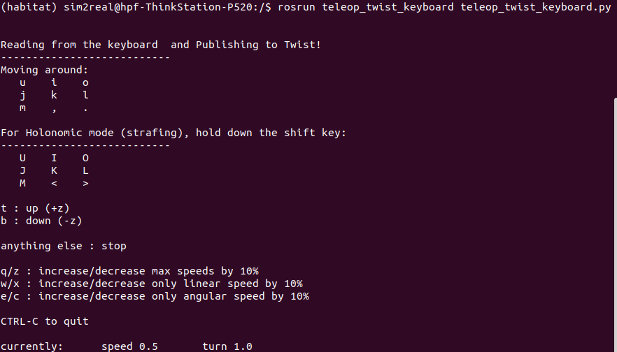

# ICRA-RM-Sim2Real

[中文版本](./README_CN.md)

Related docker repository
- https://hub.docker.com/repository/docker/hpf9017/habitat
- https://hub.docker.com/repository/docker/hpf9017/sim2real

[README of the sim2real agent](./docker_sim2real/README.md)


The diagram of the EP sim2real system
# Host operation
<font color= Red>(在安装前，须将docker_habitat完全移至~路径下)</font>
## 1. docker

If docker local installation haven't been done, switch to the docker_habitat folder first:

```
cd ~/docker_habitat
```
Execution: 

```
./docker_install.sh  
```

Evaluation

```
docker --version
```


<!-- chmod -->

If the shell script cannot be run, check if there is permission for the script. Otherwise change the mode with `chmod`

## 2. nvida driver

Check the version of host GPU driver before create the docker and container, carefully keep the same with the version inside docker. Currently the NVIDIA driver version inside the docker repos is 470.86.

Open the terminal, input nvidia-smi and press enter.


## 3. nvidia-docker2

Reference link for docker installation: 

[nvidia-docker2](https://docs.nvidia.com/datacenter/cloud-native/container-toolkit/install-guide.html)

### Main stages for docker installation reference

```
sudo systemctl --now enable docker
```

```
distribution=$(. /etc/os-release;echo $ID$VERSION_ID) \
   && curl -s -L https://nvidia.github.io/nvidia-docker/gpgkey | sudo apt-key add - \
   && curl -s -L https://nvidia.github.io/nvidia-docker/$distribution/nvidia-docker.list | sudo tee /etc/apt/sources.list.d/nvidia-docker.list
```


```
sudo apt-get update
sudo apt-get install -y nvidia-docker2
sudo systemctl restart docker
```

```
# test
sudo docker run --rm --gpus all nvidia/cuda:11.0-base nvidia-smi
```

## 4. docker login

login the docker account

```
sudo docker login
```
```
Username:hpf9017
Password:sim2real2022
```

## 5. docker image

Download the docker image:

```
sudo docker pull hpf9017/habitat:add_gate
```


Due the to the size of the image files, waiting for <font color= Red>minutes to more than an hour</font> to download the files is typical.

## 6. docker container
```
cd ~/docker_habitat
```
```
./create_container.sh
```

# Docker operation
## 1. To start the docker
<font color= Red>Run this line again after reset</font>
```
sudo docker start sim2real_env  
```

```
cd ~/docker_habitat
```
```
./exec.sh
```
password: `123`

## <font color= Red>Enter the docker</font>
## 2. habitat sim

```
cd ~  
```

```
habitat-viewer ./sim_test/scene_datasets/habitat-test-scenes/van-gogh-room.glb  
```

```
There should be a window created and scene showed in the window, use W, A, S, D to control agent move.

```


## 2. ros-x-habitat
<font color= Red>Set the environment variables while start the docker for the first time</font>

```
echo "export PYTHONPATH=$PYTHONPATH:/home/sim2real/test/src" >> ~/.bashrc
```

```
echo "source /home/sim2real/test/devel/setup.bash" >> ~/.bashrc
```
```
roscore
```
Start a new terminal
```
cd ~/docker_habitat
```
```
./exec.sh
```
```
cd ~/test/src
```
```
python3 src/scripts/roam_with_joy.py --hab-env-config-path ./configs/roam_configs/pointnav_rgbd_roam_mp3d_test_scenes.yaml --episode-id -1 --scene-id ./data/scene_datasets/mp3d/2t7WUuJeko7/2t7WUuJeko7.glb --video-frame-period 30
```


## 3. Control the movement via the keyboard

Create a new terminal

```
cd ~/docker_habitat
```
```
./exec.sh
```
```
rosrun teleop_twist_keyboard teleop_twist_keyboard.py
```


# Reference

[1] [ROS-X-Habitat: Bridging the ROS Ecosystem with Embodied AI](https://arxiv.org/abs/2109.07703) [Repo](https://github.com/ericchen321/ros_x_habitat)
[2] https://nvidia.github.io/nvidia-docker/
[3] [How to Train Your [Dragon] Embodied Agent (with AI Habitat)](https://aihabitat.org/tutorial/2020/)
[4] https://github.com/facebookresearch/habitat-lab


