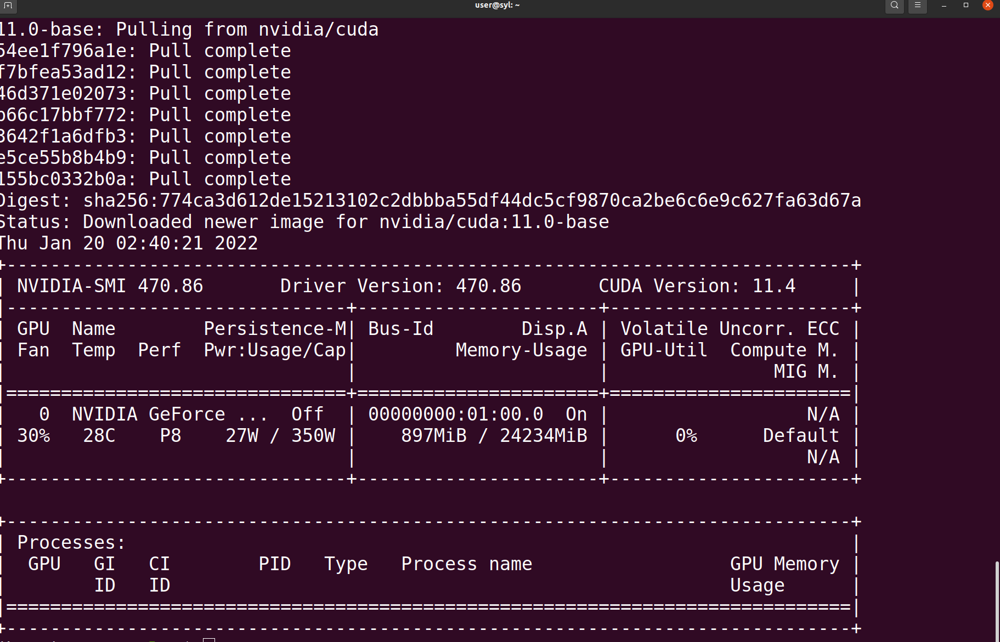
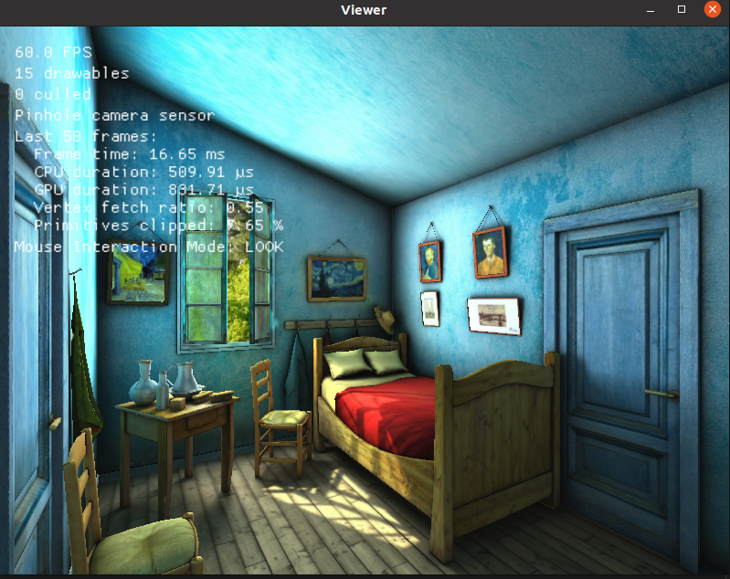
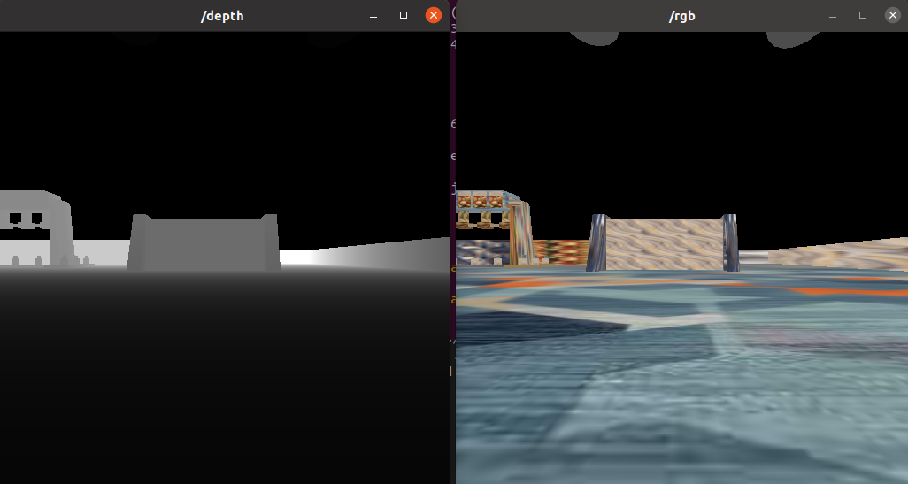

# ICRA-RM-Sim2Real

[English Version](./README.md)

# 宿主机操作
<font color= Red>(在安装前，须将docker_habitat完全移至~路径下)</font>
## 1. docker
若本地尚未安装docker，先进入docker_habitat目录:
```
cd ~/docker_habitat
```
执行:
```
./docker_install.sh  
```
验证:
```
docker --version
```


<!-- chmod -->
若脚本无法执行，则检查脚本是否有运行权限

## 2. nvida driver
创建镜像和容器前需要检查宿主机的显卡驱动是否正常，且与docker内显卡驱动版本一致，目前NVIDIA驱动版本为470.86
打开终端，输入nvidia-smi  

## 3. nvidia-docker2
安装参考连接：[nvidia-docker2](https://docs.nvidia.com/datacenter/cloud-native/container-toolkit/install-guide.html)

### 摘取的主要步骤，可做参考
```
sudo systemctl --now enable docker
```

```
distribution=$(. /etc/os-release;echo $ID$VERSION_ID) \
   && curl -s -L https://nvidia.github.io/nvidia-docker/gpgkey | sudo apt-key add - \
   && curl -s -L https://nvidia.github.io/nvidia-docker/$distribution/nvidia-docker.list | sudo tee /etc/apt/sources.list.d/nvidia-docker.list
```
https://nvidia.github.io/nvidia-docker/

```
sudo apt-get update
sudo apt-get install -y nvidia-docker2
sudo systemctl restart docker
```

```
# test
sudo docker run --rm --gpus all nvidia/cuda:11.0-base nvidia-smi
```

## 4. docker login
登录docker账号
```
sudo docker login
```
```
Username:hpf9017
Password:sim2real2022
```

## 5. docker image
下载镜像
```
sudo docker pull hpf9017/habitat:add_gate
```


<font color= Red>因为镜像文件较大，需等待较长时间</font>

## 6. docker container
```
cd ~/docker_habitat
```
```
./create_container.sh
```

# docker操作
## 1. 运行docker
<font color= Red>重启后需要执行一次</font>
```
sudo docker start sim2real_env  
```

```
cd ~/docker_habitat
```
```
./exec.sh
```
密码：123

## <font color= Red>进入docker环境</font>
## 2. habitat sim
```
cd ~  
```
```
habitat-viewer ./sim_test/scene_datasets/habitat-test-scenes/van-gogh-room.glb  
```
```
There should be a window created and scene showed in the window, use W, A, S, D to control agent move.
```


## 2. ros-x-habitat
<font color= Red>第一次进docker，设置环境变量</font>
```
echo "export PYTHONPATH=$PYTHONPATH:/home/sim2real/test/src" >> ~/.bashrc
```
```
echo "source /home/sim2real/test/devel/setup.bash" >> ~/.bashrc
```
```
roscore
```
新建terminal
```
cd ~/docker_habitat
```
```
./exec.sh
```
```
cd ~/test/src
```
```
python3 src/scripts/roam_with_joy.py --hab-env-config-path ./configs/roam_configs/pointnav_rgbd_roam_mp3d_test_scenes.yaml --episode-id -1 --scene-id ./data/scene_datasets/mp3d/2t7WUuJeko7/2t7WUuJeko7.glb --video-frame-period 30
```


## 3. 键盘控制运动
新建terminal
```
cd ~/docker_habitat
```
```
./exec.sh
```
```
rosrun teleop_twist_keyboard teleop_twist_keyboard.py
```


