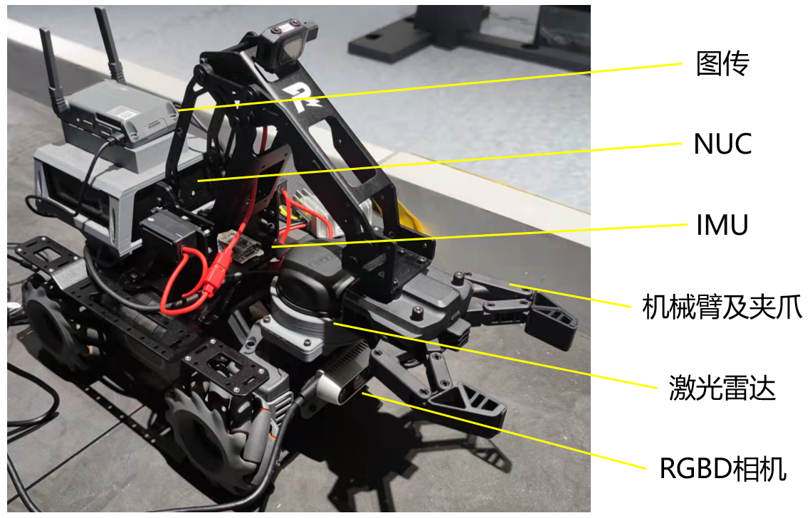
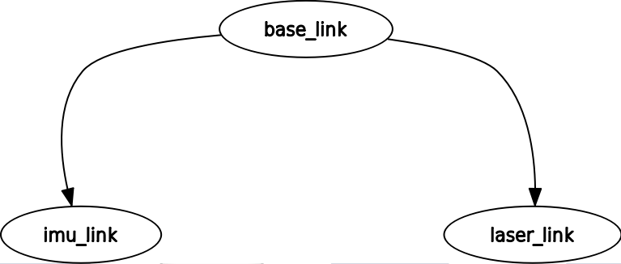
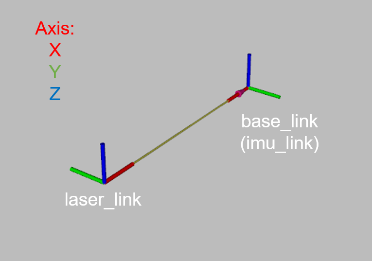
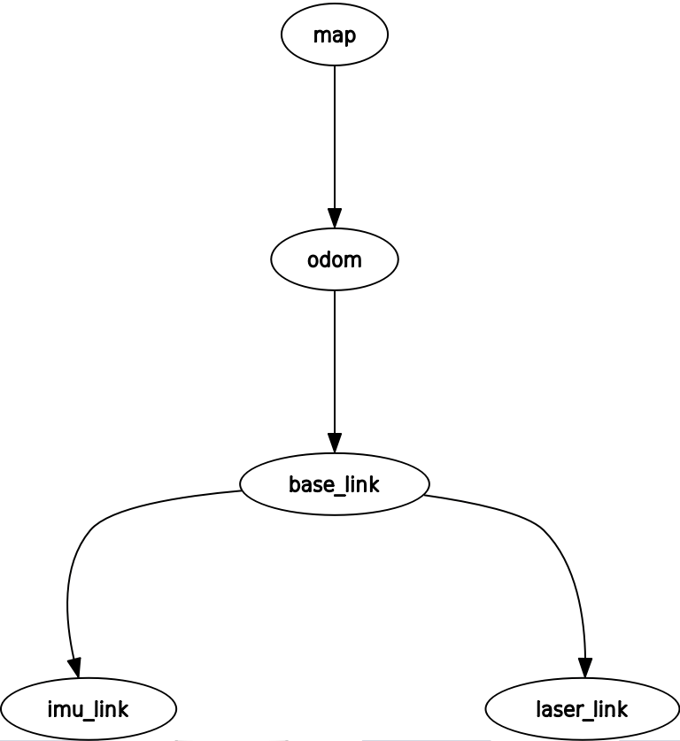

# The ROS topics and navigation system
<!-- # EP Carto Navigation Guide -->

# 1. Platform introduction

## 1.1 RoboMaster EP

<!-- https://dji-official-fe.djicdn.com/assets/uploads/v/b410280526a22148234b15b471186745.mp4 -->


<!-- [TODO] -->

the [RoboMaster EP](https://www.dji.com/cn/robomaster-ep) is a autonomous vehicle platform equipped with a 4 axis palletizing robot arm, which is inspired by DJI's annual RoboMaster robotics competition. It provided with Mecanum wheel omnidirectional movement, fast wireless data link system including realtime video stream, and open sdk for further develop and programming.



Additional to the original RoboMaster EP design, during the RUSM sim2real challenge we equipped with seperated onboard lidar, RGBD camera, to get further environment information and NUC PC to extending the online computation capacity.

## 1.2 Sensors
### 1.2.1 Lidar
​
[Rplidar A3](https://www.slamtec.com/en/Lidar/A3)

- Scan Rate:        12hz
- Sample Rate:      16000 times per second	
- Distance Range:   10~25 meter
- Minimum Operating ranging:    0.2m

### 1.2.2 IMU
​
### 1.2.3 Camera
​
[Intel Realsense D435i](https://www.intelrealsense.com/depth-camera-d435i/)

### 1.2.4 Main Controller from DJI (odometer)

# 2. Hardware interface



EP Robot tf_tree



Robot frame Axis

`/base_link`

​Robot center coordinate system, located at the center point of the 4 Mecanum wheel.

`/imu_link`

​IMU coordinate system, the same as `base_link`.

`/laser_link`

​2D LiDAR coordinate system, located at the centrer front of the vehicle.

# 3. ROS interface

The RoboMaster EP platform environment is the same as the docker provided to players, sharing the same ROS interface.

Enter the docker setup from [Install guide](./docker_sim2real/sim2real-install-guide.md), using the `rostopic` command from the cli:

`sim2real@Ubuntu:~$ rostopic list -v`

All the Published/Subscribed Topics is printed:

Published topics:
 * /rosout_agg [rosgraph_msgs/Log] 1 publisher
 * /rosout [rosgraph_msgs/Log] 6 publishers
 * /tf [tf2_msgs/TFMessage] 2 publishers
 * /image_view_rgb/parameter_descriptions [dynamic_reconfigure/ConfigDescription] 1 publisher
 * /image_view_rgb/parameter_updates [dynamic_reconfigure/Config] 1 publisher
 * /image_view_rgb/output [sensor_msgs/Image] 1 publisher
 * /image_view_depth/parameter_descriptions [dynamic_reconfigure/ConfigDescription] 1 publisher
 * /image_view_depth/parameter_updates [dynamic_reconfigure/Config] 1 publisher
 * /image_view_depth/output [sensor_msgs/Image] 1 publisher
 * /rgb [sensor_msgs/Image] 1 publisher
 * /third_rgb [sensor_msgs/Image] 1 publisher
 * /depth [sensor_msgs/Image] 1 publisher
 * /camera_info [sensor_msgs/CameraInfo] 1 publisher
 * /pointgoal_with_gps_compass [ros_x_habitat/PointGoalWithGPSCompass] 1 publisher
 * /ray [sensor_msgs/LaserScan] 1 publisher
 * /odom [nav_msgs/Odometry] 1 publisher
 * /gripper_state [geometry_msgs/Point] 1 publisher

Subscribed topics:
 * /rosout [rosgraph_msgs/Log] 1 subscriber
 * /rgb [sensor_msgs/Image] 1 subscriber
 * /depth [sensor_msgs/Image] 1 subscriber
 * /pointgoal_with_gps_compass [ros_x_habitat/PointGoalWithGPSCompass] 1 subscriber
 * /cmd_vel [geometry_msgs/Twist] 1 subscriber
 * /arm_gripper [geometry_msgs/Point] 1 subscriber
 * /arm_position [geometry_msgs/Pose] 1 subscriber
 * /cmd_position [geometry_msgs/Twist] 1 subscriber

## 3.1 Subscribe the topic

`/cmd_vel` [geometry_msgs/Twist]

<!-- ​由EP机器人底盘执行的速度指令，推荐范围： -->
Velocity command for the EP chassis, recommend range:

<!-- 
 -->

$$0.1m/s\leq|v_x|\leq0.35m/s$$
$$0.1m/s\leq|v_y|\leq0.35m/s$$
$$0.1rad/s\leq|v_{th}|\leq0.5rad/s$$

`/arm_gripper` [geometry_msgs/Point]

<!-- [TODO] -->
<!-- 由机械臂执行的机械臂位置控制指令， 推荐范围：【待定】 -->
Position control command for the Robotic arm:

`/arm_position` [geometry_msgs/Point]

<!-- 由夹爪执行的夹持动作指令，推荐范围：【待定】 -->
Grasper command:

`/arm_gripper` [geometry_msgs/Point]

## 3.2 Publish topics

`/ep/odom` [nav_msgs/Odometry] default: 10hz
​
<!-- 由大疆主控解算获得，包含机器人位姿和速度信息。 -->
Obtained by DJI master control solution, including robot pose and speed information.

`/rplidar/scan` [sensor_msgs/LaserScan] default: 12hz
​
<!-- 由激光雷达结算获得，包含场景扫描信息，范围包括机器人正前方270° -->
Obtained by LiDAR settlement, including scene scanning information, the range includes 270° in front of the robot.

`/imu/data_raw` [sensor_msgs/LaserScan] default: 60hz
​
<!-- 由机器人本体/外挂IMU获得，包含旋转、速度和加速度信息。 -->
Obtained by the robot body/external IMU, including rotation, speed and acceleration information.

# 4. Tutorial for instance

## 4.0 Enter the docker

### 4.0.1 Docker image for habitat simulator

```bash
# start Habitat simulator docker image for the first time
$ cd docker_habitat
$ ./create_container.sh
$ ./exec.sh
```

<!-- 再次启动镜像，无需执行create_container_algo.sh脚本，否则会丢失所有对镜像的修改， -->
Start the image again. 

Note **Do Not** executing the `create_container_algo.sh` script, otherwise all modifications to the image will be lost:

```bash
# Firstly
$ sudo docker ps -a #get the current [container ID]
$ sudo docker start [container_ID]
# after the container started
$ cd docker_habitat
$ ./exec_.sh
```

<!-- 选手算法运行环境镜像sim2real -->
### 4.0.2 Algorithm environment for users

```bash
# start Habitat simulator docker image for the first time
$ cd docker_sim2real
$ ./create_container_algo.sh
$ ./exec_algo.sh
```

<!-- 再次启动镜像，无需执行create_container_algo.sh脚本，否则会丢失所有对镜像的修改， -->
Start the image again. 
<!-- [TODO] -->
Note **Do Not** executing the `create_container_algo.sh` script, otherwise all modifications to the image will be lost:

```bash
# Firstly
$ sudo docker ps -a #get the current [container ID]
$ sudo docker start container_ID
# after the container started
$ cd docker_sim2real
$ ./exec_algo.sh
```

## 4.1 Map based on cartographer

```bash
$ roslaunch carto_navigation mapping_sim.launch
```

Config files located at `~/ep_ws/src/carto_navigation/param/` as `cartographer.lua` and `cartographer_localization.lua`.While the map finished, save the map and run:

```bash
$ ~/ep_ws/src/carto_navigation/launch/map_writer.sh
```

Defaultly, the map saved here: `~/ep_ws/src/carto_navigation/maps/`

## 4.2 Lider navigation based on `cartographer` and `move_base`

```bash
$ roslaunch carto_navigation navigation_sim.launch
```
<!-- 
可在`~/ep_ws/src/carto_navigation/launch/`目录中的`move_base.launch`修改使用的规划器（`dwa/teb`）,配置文件分别位于`~/ep_ws/src/carto_navigation/param/`中相应名字的目录中。 -->

The used planner (`dwa/teb`) can be modified in `move_base.launch` in the `~/ep_ws/src/carto_navigation/launch/` directory, and the configuration files are located in `~/ep_ws/src/carto_navigation/param/ ` in the directory with the corresponding name.

<!-- 基于cartographer的激光雷达导航完整的tf树如下图所示 -->
The complete `tf tree` of lidar navigation based on `cartographer` is shown in the figure below:



<!-- 包含仿真环境坐标系（world）地图坐标系（map）、里程计坐标系（odom），同时隐藏了机器人传感器坐标系（laser_link和imu_link）的图示。 -->

Contains the simulation environment coordinate system `world`, the map coordinate system `map`, the odometer coordinate system `odom`, and hides the icons of the robot sensor coordinate system (`laser_link` and `imu_link`).


## 4.3 Optional remote control

XBOX 360 controller remote control has been intergrated in the launch file, to start the functionality:
<!-- 遥控功能已集成在3.1和3.2中的launch文件，如果需要单独启动或使用键盘遥控： -->

```bash
# Keyboard
$ rosrun teleop_twist_keyboard teleop_twist_keyboard.py
# Game controller
$ roslaunch carto_navigation joy_stick.launch
```

# 5. Others

<!-- ## 4.1 launch文件中涉及环境变量的部分 -->
## 4.1 Environment variables in launch files
​
<!-- 选手请勿更改此部分，镜像中已针对仿真和现实做出了区别处理。 -->
Players **should not** change this part, the docker image has made a distinction between simulation and reality.

## 4.2 Remap for the right topics
​
In order to make the Topic express its meaning more clearly, while avoiding the conflict of the same type of data from different sensors, topics such as `/rplidar/scan`, `/ep/odom` are used instead of the common `/scan`, `/odom` `, please use in the launch file tags to remap topics.
