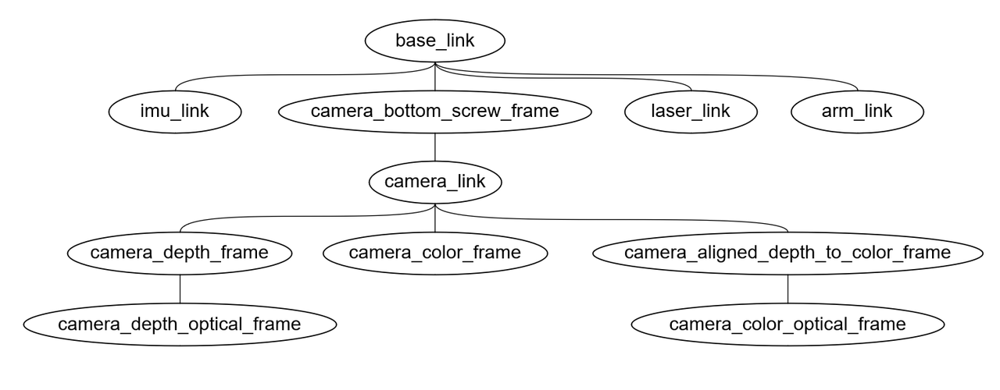
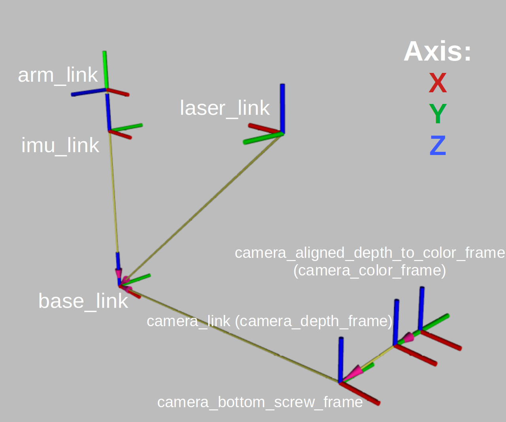

# EP Carto Navigation Guide

# 1.平台介绍

## 1.1 RoboMaster EP

<!-- [TODO] -->
RoboMaster EP是大疆的xxx机器人,采用麦克纳姆轮实现全向移动...

与赛会主题sim2real契合，增加了传感器，致力于将仿真环境与现实应用打通...


比赛用RoboMaster EP机器人平台

## 1.2 传感器介绍
### 1.2.1 激光雷达
​
思岚科技rplidar A3

- 频率12hz
- 扫描频率
- 采样率
- 距离

### 1.2.2 IMU
​
### 1.2.3 摄像头
​
Intel Realsense D435i

### 1.2.4 大疆主控（里程计）

# 2. 硬件接口



EP Robot tf_tree



Robot frame Axis

`/base_link`

​机器人中心坐标系，位置在四个麦克纳姆轮的中心。

`/imu_link`

​IMU传感器坐标系，与base_link重叠。

`/laser_link`

​2D LiDAR传感器坐标系，位置在车正前方。

# 3. ROS软件接口

​比赛用RoboMaster EP机器人平台已与选手用Docker镜像同步，两者ROS接口完全一致。

进入前述[教程](./README_CN.md)安装的docker，使用`rostopic`命令：

`sim2real@Ubuntu:~$ rostopic list -v`

可以打印输出所有Published/Subscribed所有相关Topics：

Published topics:
 * /rosout_agg [rosgraph_msgs/Log] 1 publisher
 * /rosout [rosgraph_msgs/Log] 6 publishers
 * /tf [tf2_msgs/TFMessage] 2 publishers
 * /image_view_rgb/parameter_descriptions [dynamic_reconfigure/ConfigDescription] 1 publisher
 * /image_view_rgb/parameter_updates [dynamic_reconfigure/Config] 1 publisher
 * /image_view_rgb/output [sensor_msgs/Image] 1 publisher
 * /image_view_depth/parameter_descriptions [dynamic_reconfigure/ConfigDescription] 1 publisher
 * /image_view_depth/parameter_updates [dynamic_reconfigure/Config] 1 publisher
 * /image_view_depth/output [sensor_msgs/Image] 1 publisher
 * /rgb [sensor_msgs/Image] 1 publisher
 * /third_rgb [sensor_msgs/Image] 1 publisher
 * /depth [sensor_msgs/Image] 1 publisher
 * /camera_info [sensor_msgs/CameraInfo] 1 publisher
 * /pointgoal_with_gps_compass [ros_x_habitat/PointGoalWithGPSCompass] 1 publisher
 * /ray [sensor_msgs/LaserScan] 1 publisher
 * /odom [nav_msgs/Odometry] 1 publisher
 * /gripper_state [geometry_msgs/Point] 1 publisher

Subscribed topics:
 * /rosout [rosgraph_msgs/Log] 1 subscriber
 * /rgb [sensor_msgs/Image] 1 subscriber
 * /depth [sensor_msgs/Image] 1 subscriber
 * /pointgoal_with_gps_compass [ros_x_habitat/PointGoalWithGPSCompass] 1 subscriber
 * /cmd_vel [geometry_msgs/Twist] 1 subscriber
 * /arm_gripper [geometry_msgs/Point] 1 subscriber
 * /arm_position [geometry_msgs/Pose] 1 subscriber
 * /cmd_position [geometry_msgs/Twist] 1 subscriber

## 3.1.订阅话题

`/cmd_vel` (geometry_msgs/Twist)

​由EP机器人底盘执行的速度指令，推荐范围：

<!-- 
 -->

$$0.1m/s\leq|v_x|\leq0.35m/s$$
$$0.1m/s\leq|v_y|\leq0.35m/s$$
$$0.1rad/s\leq|v_{th}|\leq0.5rad/s$$

`/arm_gripper` (geometry_msgs/Point)

<!-- [TODO] -->
由机械臂执行的机械臂位置控制指令， 推荐范围：【待定】

`/arm_position` (geometry_{msgs}/Point)

由夹爪执行的夹持动作指令，推荐范围：【待定】

## 3.2 发布话题

`/ep/odom` (nav_msgs/Odometry) default: 10hz
​
由大疆主控解算获得，包含机器人位姿和速度信息。

`/rplidar/scan` (sensor_msgs/LaserScan) default: 12hz
​
由激光雷达结算获得，包含场景扫描信息，范围包括机器人正前方270°

`/imu/data_raw` (sensor_msgs/LaserScan) default: 60hz
​
由机器人本体/外挂IMU获得，包含旋转、速度和加速度信息。


# 4. 实例教程

## 4.0 进入docker镜像

### 4.0.1 habitat仿真环境镜像habitat

```bash
# 首次启动habitat仿真环境docker镜像
$ cd docker_habitat
$ ./create_container.sh
$ ./exec.sh
```

再次启动镜像，无需执行create_container_algo.sh脚本，否则会丢失所有对镜像的修改，

```bash
# 首先通过
$ sudo docker ps -a #获取当前[container ID]
$ sudo docker start [container_ID]
# 运行容器后
$ cd docker_habitat
$ ./exec_.sh
```

### 4.0.2 选手算法运行环境镜像sim2real

```bash
# 首次启动habitat仿真环境docker镜像
$ cd docker_sim2real
$ ./create_container_algo.sh
$ ./exec_algo.sh
```

再次启动镜像，无需执行create_container_algo.sh脚本，否则会丢失所有对镜像的修改，

```bash
# 首先通过
$ sudo docker ps -a #获取当前container
$ sudo docker start container_ID
# 运行容器后
$ cd docker_sim2real
$ ./exec_algo.sh
```

## 4.1 基于cartographer的建图

```bash
$ roslaunch carto_navigation mapping_sim.launch
```

​配置文件在~/ep_ws/src/carto_navigation/param/目录的cartographer.lua和cartographer_localization.lua。当建图完成，需要保存地图，运行：

```bash
$ ~/ep_ws/src/carto_navigation/launch/map_writer.sh
```

地图默认保存在~/ep_ws/src/carto_navigation/maps/目录

3.2.基于cartographer和move_base的激光导航

```bash
$ roslaunch carto_navigation navigation_sim.launch
```

可在~/ep_ws/src/carto_navigation/launch/目录中的move_base.launch修改使用的规划器（dwa/teb）,配置文件分别位于~/ep_ws/src/carto_navigation/param/中相应名字的目录中。

基于cartographer的激光雷达导航完整的tf树如下图所示


包含仿真环境坐标系（world）地图坐标系（map）、里程计坐标系（odom），同时隐藏了机器人传感器坐标系（laser_link和imu_link）的图示。


## 4.3 （可选）机器人遥控

手柄（XBOX 360）遥控功能已集成在3.1和3.2中的launch文件，如果需要单独启动或使用键盘遥控：

```bash
# 键盘遥控
$ rosrun teleop_twist_keyboard teleop_twist_keyboard.py
# 手柄遥控
$ roslaunch carto_navigation joy_stick.launch
```

# 5.其他

## 4.1 launch文件中涉及环境变量的部分
​
选手请勿更改此部分，镜像中已针对仿真和现实做出了区别处理。

## 4.2 善于使用remap功能
​
为了使Topic能够更清晰地表达含义，同时避免来自不同传感器的相同类型数据冲突，使用了诸如`/rplidar/scan`、`/ep/odom`等话题代替常见的`/scan`、`/odom`，请在launch文件使用
标签，将话题重新映射。
