# 宿主机操作
## 1. 安装 docker
安装参考连接：[docker install](https://docs.docker.com/engine/install/ubuntu/)

若本地尚未安装docker，先进入docker_server目录:
```
cd ICRA-RM-Sim2Real/docker_server
```
执行:
```
./docker_install.sh  
```
若脚本无法执行，则检查脚本是否有运行权限

验证:
```
docker --version
```
<!-- 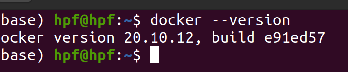 -->


<!-- chmod -->

## 2. 安装 nvida driver
推荐使用Software & Updates中Additional Drivers安装

创建镜像和容器前需要检查宿主机的显卡驱动是否正常

打开终端，输入nvidia-smi  
<!-- 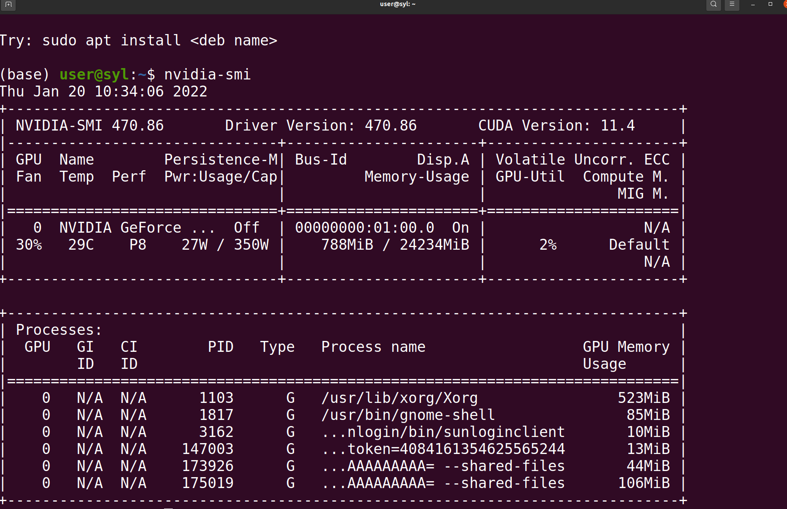 -->


<font color= Red>目前支持的驱动版本为470和510</font>

## 3. 安装 nvidia-docker2
安装参考连接：[nvidia-docker2](https://docs.nvidia.com/datacenter/cloud-native/container-toolkit/install-guide.html)

### 摘取的主要步骤，可做参考
```
sudo systemctl --now enable docker
```

```
distribution=$(. /etc/os-release;echo $ID$VERSION_ID) \
   && curl -s -L https://nvidia.github.io/nvidia-docker/gpgkey | sudo apt-key add - \
   && curl -s -L https://nvidia.github.io/nvidia-docker/$distribution/nvidia-docker.list | sudo tee /etc/apt/sources.list.d/nvidia-docker.list
```

```
sudo apt-get update
sudo apt-get install -y nvidia-docker2
sudo systemctl restart docker
```
验证：
```
sudo docker run --rm --gpus all nvidia/cuda:11.0-base nvidia-smi
```
<!-- 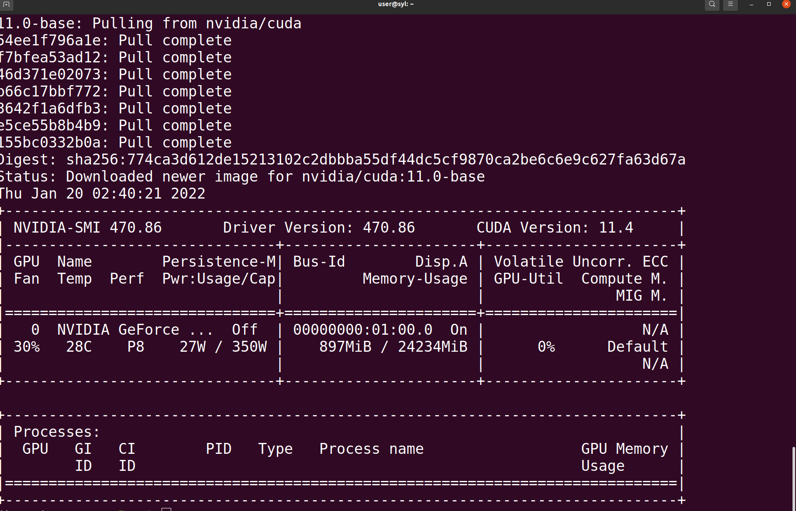 -->


## 4. 注册 dockerhub
注册dockerhub账号：[dockerhub](https://hub.docker.com/)

登录dockerhub账号
```
sudo docker login
```
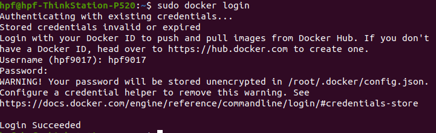

## 5. 下载 docker image
下载镜像<font color= Red>(tag以最后发布为准)</font>
```
sudo docker pull rmus2022/server:v0.0.2
```
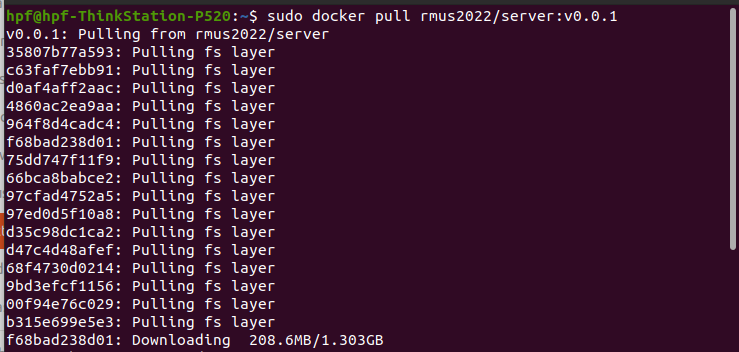

<font color= Red>因为镜像文件较大，需等待较长时间</font>

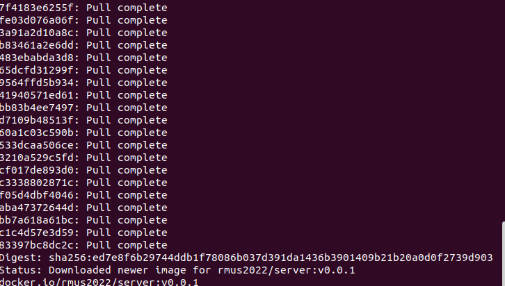

## 6. 创建 docker container
```
cd ICRA-RM-Sim2Real/docker_server
```
<font color= Red>需要确认create_container_server中的tag为正确版本</font>

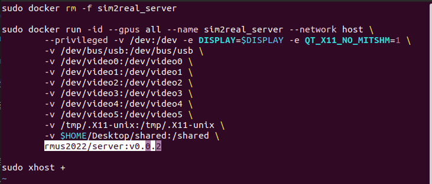
```
./create_container_server.sh
```
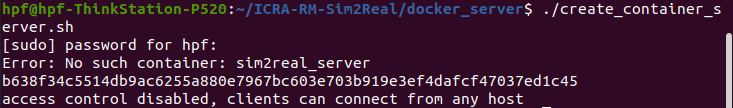

<font color= Red>当本地没有sim2real_server容器时会报错，不影响</font>

<font color= Red>每次运行该脚本，会删除没有docker commit的修改</font>


# docker server操作
## 1. 运行docker
<font color= Red>重启后需要执行一次</font>
```
sudo docker start sim2real_server 
```

```
cd ICRA-RM-Sim2Real/docker_server
```
<font color= Red>密码：123</font>
```
./exec_server.sh
```

## <font color= Red>进入docker环境</font>
## 2. 运行habitat sim例程
```
cd ~/habitat-sim/
```
```
./build/viewer ./data/scene_datasets/habitat-test-scenes/van-gogh-room.glb 
```
<font color= Red>可以通过 w, a, s, d控制机器人移动，通过方向键控制机器人视角。</font>


## 3. 运行server环境
新建terminal
```
cd ICRA-RM-Sim2Real/docker_server
```
```
./exec_server.sh
```
```
roscore
```
新建terminal
```
cd ICRA-RM-Sim2Real/docker_server
```
```
./exec_server.sh
```
```
cd ~/ros_x_habitat_ws/src/ros_x_habitat/
```
```
python3 src/scripts/roam_with_joy.py --hab-env-config-path ./configs/roam_configs/pointnav_rgbd_roam_mp3d_test_scenes.yaml
```
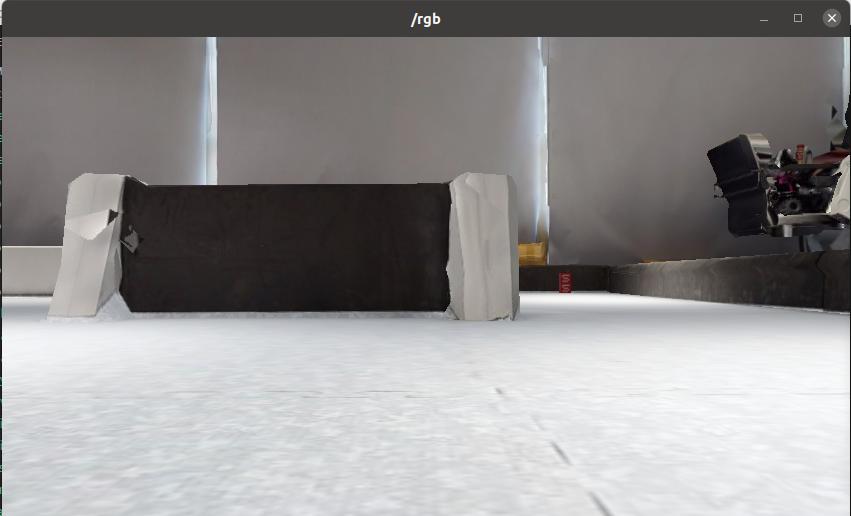
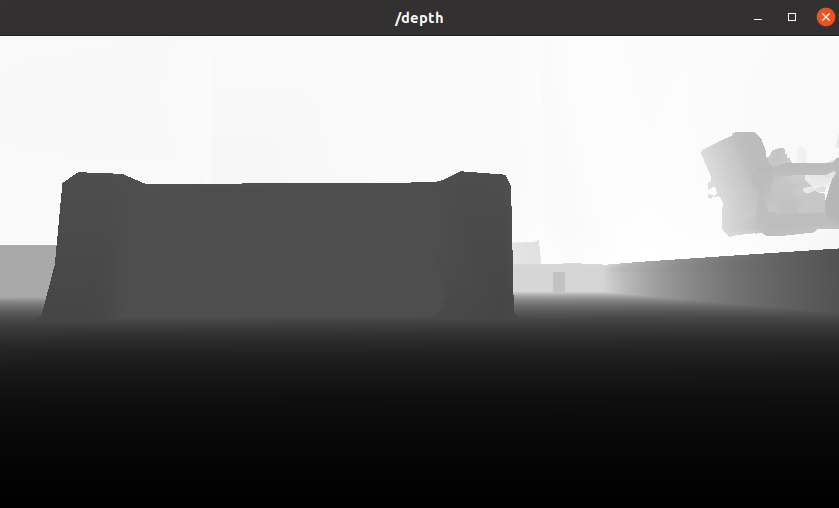
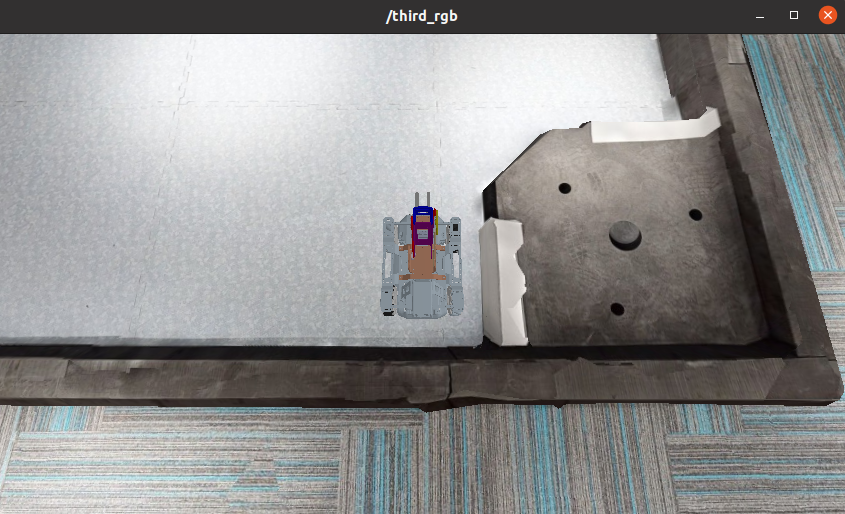

## 4. 键盘控制运动和抓取
新建terminal
```
cd ICRA-RM-Sim2Real/docker_server
```
```
./exec_server.sh
```
```
rosrun teleop_twist_keyboard teleop_twist_keyboard.py
```

<font color= Red>需要鼠标点击，激活键盘控制程序的terminal</font>

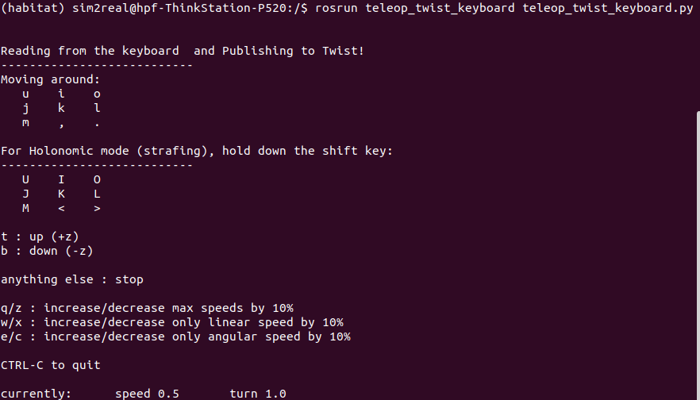

<font color= Red>按键q，z，增大和降低机器人速度</font>

按键i，j，，，l， 控制机器人前进后退和旋转

<font color= Red>按键I，J，<，L，控制机器人横向移动</font>

通过k，停止机器人运动

按键1，移动机械臂到抓取位置

按键2，移动机械臂到放置位置

按键3，抓取矿石

按键4，放置矿石

# docker client操作
## 1. 下载 docker image
下载镜像<font color= Red>(tag以最后发布为准)</font>
```
sudo docker pull rmus2022/client:v0.0.0
```

## 2. 创建 docker container
```
cd ICRA-RM-Sim2Real/docker_client
```
<font color= Red>需要确认create_container_client中的tag为正确版本</font>

<font color= Red>需要根据宿主机的cpu修改create_container_client.sh中的cpu和内存参数</font>

cpu参数计算公式：
```
cpu=（NUC的cpu单核频率 × NUC的cpu个数）/ 宿主机单核频率
```
举例：

宿主机cpu为：Intel® Xeon(R) W-2125 CPU @ 4.00GHz × 8

机器人cpu为：11th Gen Intel® Core i7-1165G7 @ 2.80GHz × 8

则cpu=（2.8 × 8) / 4 = 5.6

机器人内存为：8GB

则M=8192M
```
./create_container_client.sh
```

<font color= Red>当本地没有sim2real_client容器时会报错，不影响</font>

<font color= Red>每次运行该脚本，会删除没有docker commit的修改</font>

## 3. rtab navigation
### 运行server环境（docker server操作步骤3）
正确显示rgb、depth、third_rgb画面

<font color= Red>如果出现错误，重启启动一次</font>

### 运行client环境
<font color= Red>重启后需要执行一次</font>
```
sudo docker start sim2real_client
```
新建terminal
```
cd ICRA-RM-Sim2Real/docker_client
```
```
./exec_client.sh
```

```
cd ~
```
```
roslaunch habitat_navigation rtab_navigation.launch
```
通过rviz发送2D Nav Goal

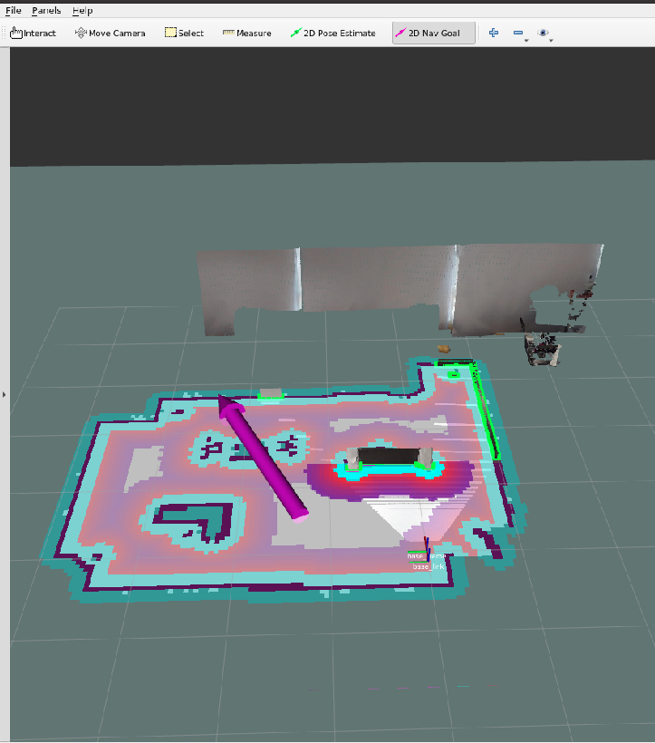


## 4. cartographer navigation
### 运行server环境（docker server操作步骤3）
正确显示rgb、depth、third_rgb画面

<font color= Red>如果出现错误，重启启动一次</font>

### 运行client环境

新建terminal
```
cd ICRA-RM-Sim2Real/docker_client
```
```
./exec_client.sh
```
```
cd ~
```
```
roslaunch carto_navigation env.launch
```

新建terminal
```
cd ICRA-RM-Sim2Real/docker_client
```
```
./exec_client.sh
```
```
cd ~
```
```
roslaunch carto_navigation navigation.launch
```
通过rviz发送2D Nav Goal

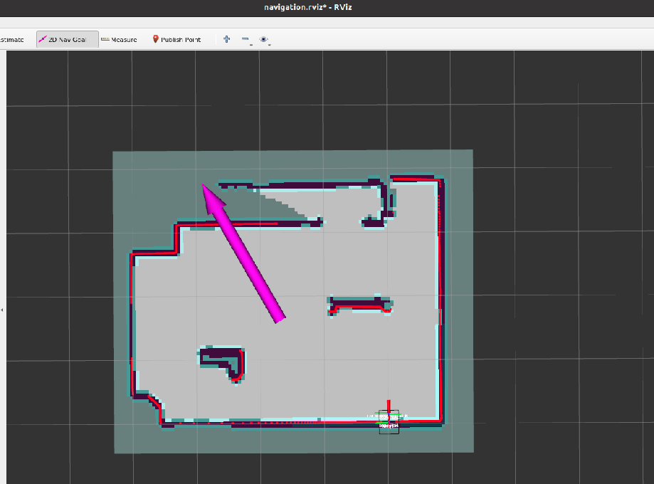


## 4. 抓取矿石（待补充）

## 4. 放置矿石（待补充）

# 上传client镜像

## 1. 新建privtate repo
参赛队伍在自己注册的dockerhub上新建一个private repo，名字为rmus2022

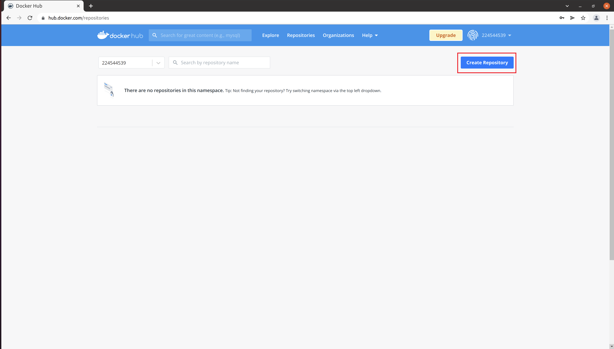

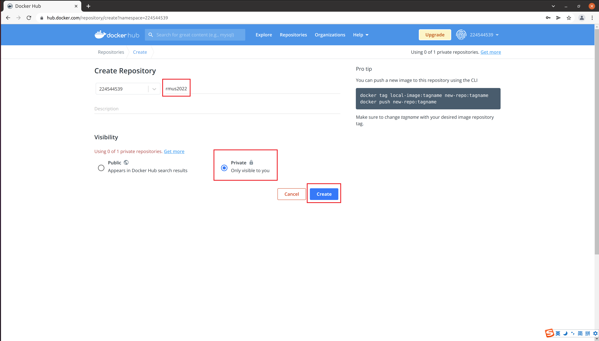

## 2. 将client镜像push到private repo
将下载的client镜像打上tag(tag名称，参赛队伍可以自定义)，dockerhub_name为dcokerhub的账号名字
```
sudo docker tag rmus2022/client:v.0.1.0 dockerhub_name/rmus2022:tag
```
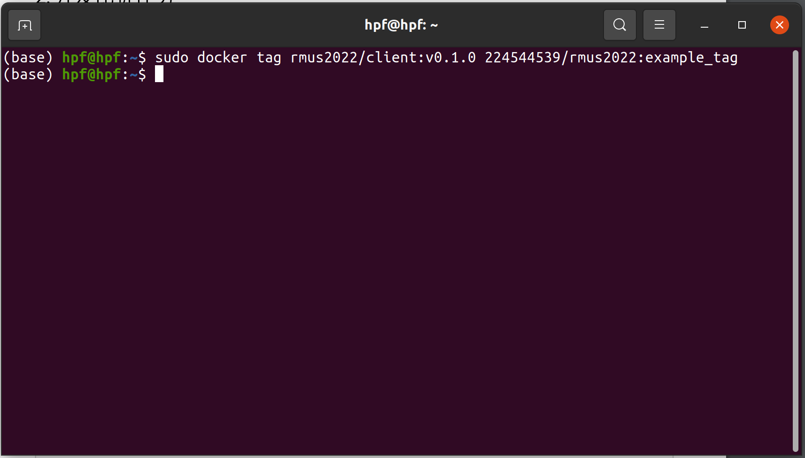

将新tag的client镜像push到private repo
```
sudo docker push dockerhub_name/rmus2022:tag
```

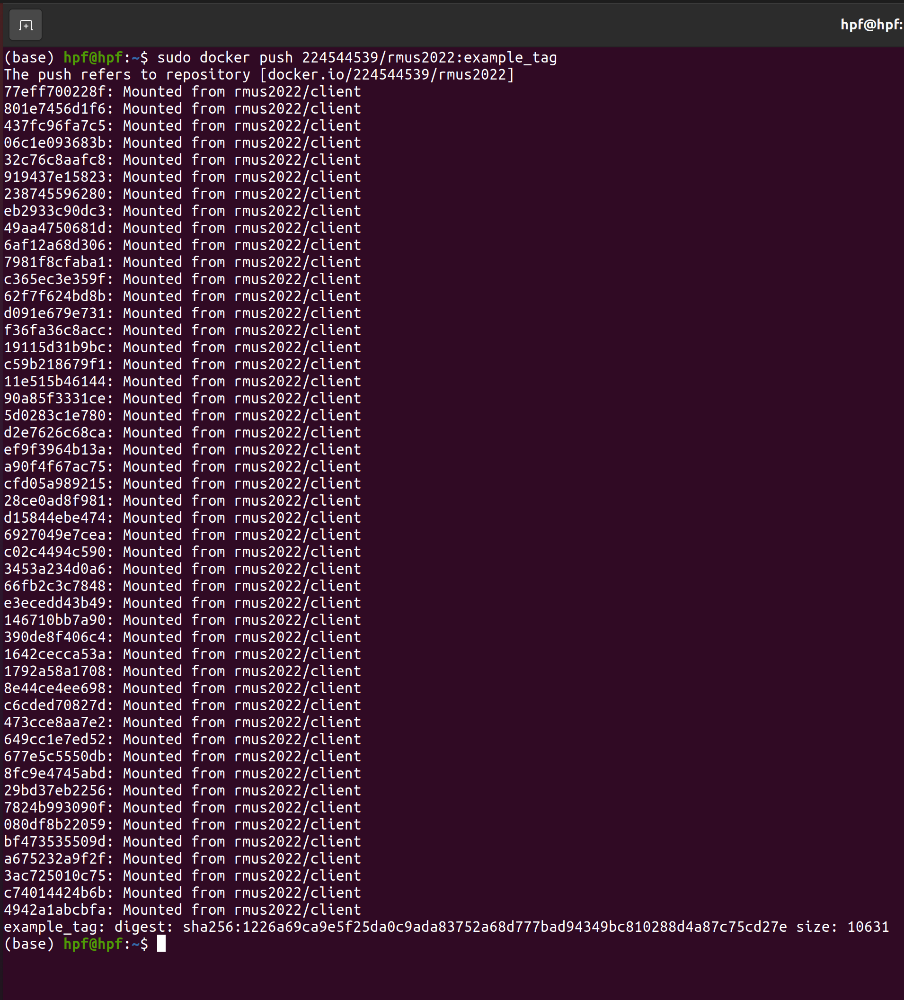

## 2. 开发比赛任务
根据private repo和tag名字，修改create_client里的镜像名和tag

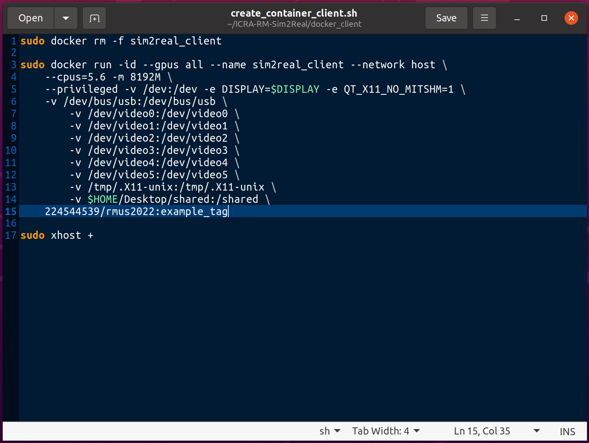

运行create_client.sh，创建新容器

运行exec_client.sh，进入client镜像进行开发

推荐使用git工具管理好代码版本

在docker中可以通过vscode进行开发

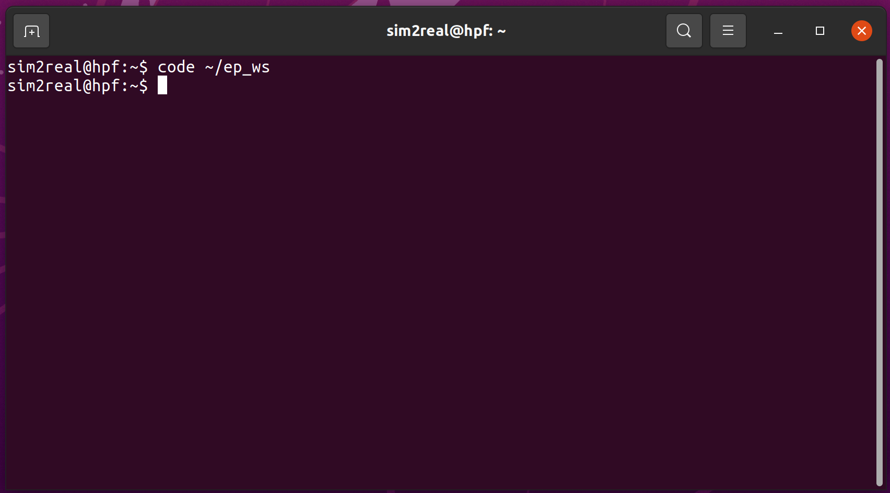

## 3. docker commit
本地保存镜像修改内容，使用原有的tag会覆盖之前tag版本的内容
```
sudo docker commit sim2real_client dockerhub_name/rmus2022:new_tag
```

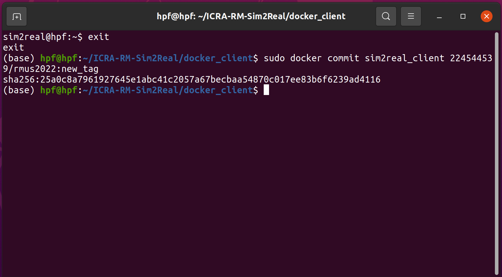

## 4. docker push
通过docker push到private repo保存当前docker镜像到dockerhub
```
sudo docker push dockerhub_name/rmus2022:tag
```

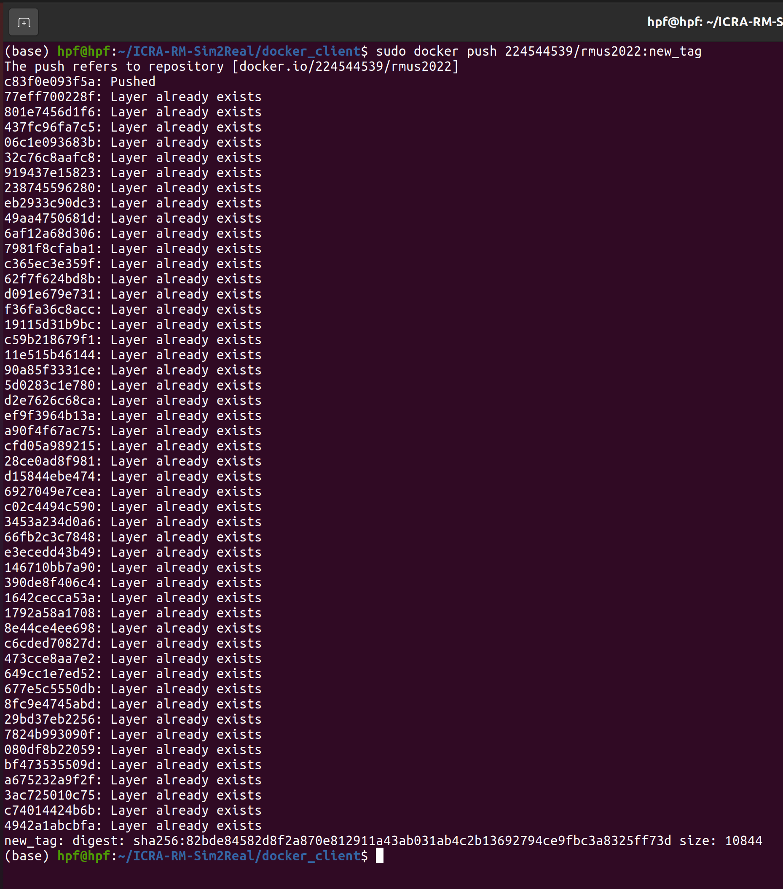

## 5，生成访问token
参考连接：[docker token](https://docs.docker.com/docker-hub/access-tokens/)

在需要提交测试的版本时，
将dockerhub用户名、docker token由比赛系统提交。

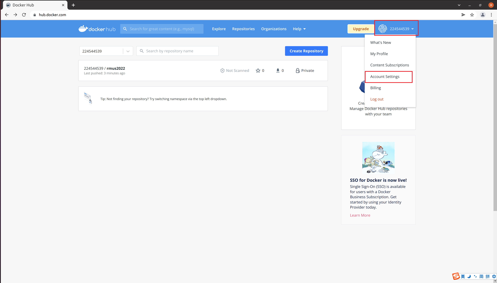

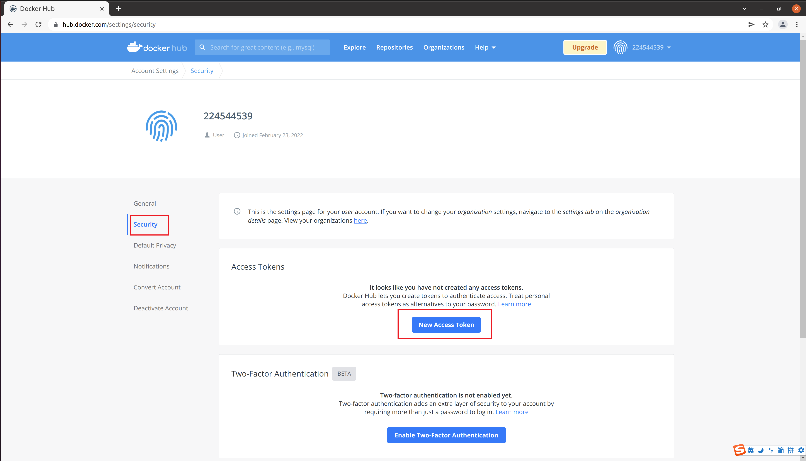

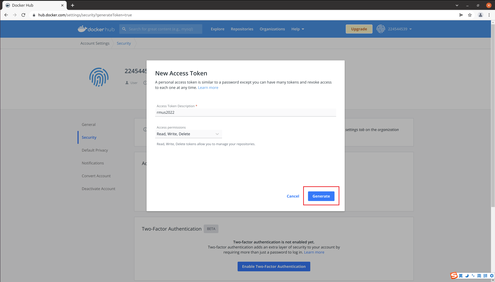

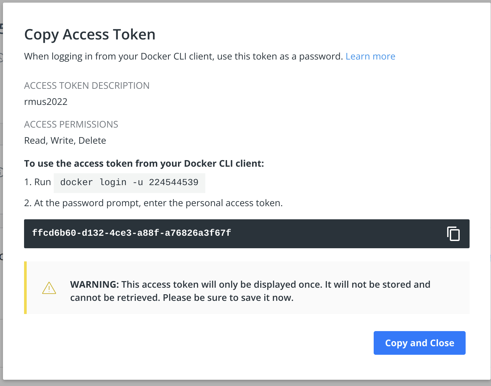


