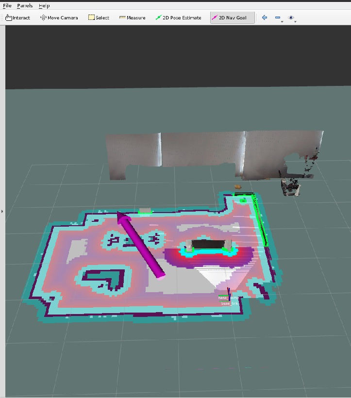
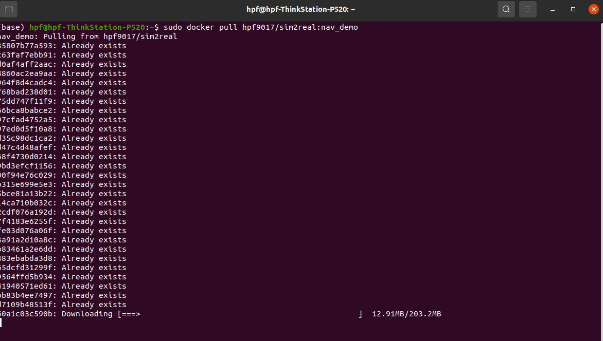
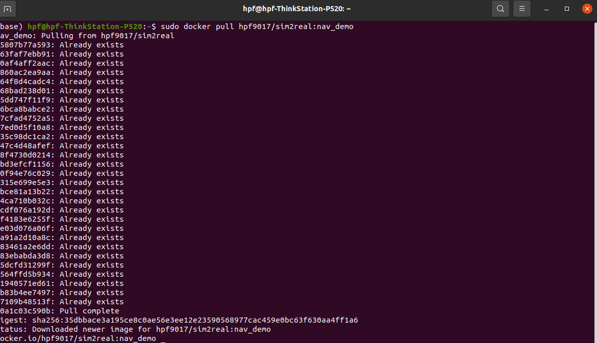

# Host operation
<!-- <font color= Red>(在安装前，须将docker_habitat完全移至~路径下)</font> -->
## 1. Docker

Reference for docker installation on Ubuntu: 
- [docker install](https://docs.docker.com/engine/install/ubuntu/)

If docker local installation hasn't been done, switch to the docker_server folder first:

```
cd ./ICRA-RM-Sim2Real/docker_server
```

Execution: 

```bash
./docker_install.sh  
```

Evaluation

```bash
docker --version
```
<!--  -->


<!-- chmod -->

If the shell script cannot be run, check if there is permission for the script. Otherwise change the mode with `chmod`

## 2. Nvidia driver

Check the version of host GPU driver before creating the docker and container, carefully keeping the same with the version inside docker. Currently the NVIDIA driver version inside the docker repos is 470.86.

In Ubuntu, `Software & Updates > Additional Drivers` is recommanded to update the Nvidia driver.

Open the terminal, input nvidia-smi and press enter to get the driver version:

<!--  -->


Know issue:
- If your OS is Ubuntu21.04 or later, please refer to [issue 18](https://github.com/AIR-DISCOVER/ICRA-RM-Sim2Real/issues/18) to fix.

## 3. Install the `nvidia-docker2`

Reference link for docker installation: 

[nvidia-docker2](https://docs.nvidia.com/datacenter/cloud-native/container-toolkit/install-guide.html)

### Main stages for docker installation reference

```bash
sudo systemctl --now enable docker
```

```bash
distribution=$(. /etc/os-release;echo $ID$VERSION_ID) \
   && curl -s -L https://nvidia.github.io/nvidia-docker/gpgkey | sudo apt-key add - \
   && curl -s -L https://nvidia.github.io/nvidia-docker/$distribution/nvidia-docker.list | sudo tee /etc/apt/sources.list.d/nvidia-docker.list
```


```bash
sudo apt-get update
sudo apt-get install -y nvidia-docker2
sudo systemctl restart docker
```

```bash
# test
sudo docker run --rm --gpus all nvidia/cuda:11.0-base nvidia-smi
```
<!--  -->


## 4. docker login

Register the dockerhub account: 
- [dockerhub](https://hub.docker.com/)

And get access token for late use: 
- https://docs.docker.com/docker-hub/access-tokens/

login the docker account

```
sudo docker login
```


## 5. Download the docker image

Download the docker image:

<!-- sudo docker pull hpf9017/habitat:add_gate -->

```
sudo docker pull rmus2022/server:v1.0.0
```


Due to the size of the image files, waiting for <font color= Red>minutes to more than an hour</font> to download the files is typical.


## 6. Create the docker container

```bash
cd ./ICRA-RM-Sim2Real/docker_server
```
<font color= Red>Please ensure the right `tag` version in `create_container_server.sh`</font>


```bash
./create_container_server.sh
```


<font color= Red>An `Error` will be reported while there is no  `sim2real_server` container. No need to worry.</font>

<font color= Red>Changes without `docker commit` will be deleted after each time the script run.</font>

# Docker `Server` operation


## 1. To start the docker

<font color= Red>Run this line again after reset</font>

```bash
sudo docker start sim2real_server 
```

```bash
cd ./ICRA-RM-Sim2Real/docker_server
```

password: `123`

```bash
./exec_server.sh
```

## <font color= Red>Enter the docker</font>

## 2. Start the Habitat sim

```bash
cd ~/habitat-sim/
```

```bash
./build/viewer ./data/scene_datasets/habitat-test-scenes/van-gogh-room.glb 
```
<!-- ./habitat-viewer ./sim_test/scene_datasets/habitat-test-scenes/van-gogh-room.glb   -->

There should be a window created and scene showed in the window, use W, A, S, D to control agent move.


## 3. Start the `server` simulator
<!-- 
<font color= Red>Set the environment variables while starting the docker for the first time</font>

```bash
echo "export PYTHONPATH=$PYTHONPATH:/home/sim2real/test/src" >> ~/.bashrc
```

```
echo "source /home/sim2real/test/devel/setup.bash" >> ~/.bashrc
``` -->

Start a new terminal.

```bash
cd ./ICRA-RM-Sim2Real/docker_server
```

```bash
./exec_server.sh
```

```
roscore
```

Create a new terminal

```bash
cd ./ICRA-RM-Sim2Real/docker_server
```

```bash
./exec_server.sh
```

```bash
cd ~/ros_x_habitat_ws/src/ros_x_habitat/
```

```bash
python3 src/scripts/roam_with_joy.py --hab-env-config-path ./configs/roam_configs/pointnav_rgbd_roam_mp3d_test_scenes.yaml
```

 <!-- --episode-id -1 --scene-id ./data/scene_datasets/mp3d/2t7WUuJeko7/2t7WUuJeko7.glb --video-frame-period 30 -->


## 4. Control the movement via the keyboard

Create a new terminal

```bash
cd ./ICRA-RM-Sim2Real/docker_server
```
```bash
./exec_server.sh
```
```
rosrun teleop_twist_keyboard teleop_twist_keyboard.py
```

<font color= Red>Mouse click to activate the terminal of keyboard control</font>


<font color= Red>Press `q`, `z`, increase or decrease the speed of the robot.</font>

Press `i`， `j`， `，` ， `l`， to control forward/backward/rotation.

Press `I`， `J`， `<`， `L`， to control the horizontal movement.

Press `k`, stop the robot moving.

Press `1`, to move the robotic arm to the place to grab up.

Press `2`， to move the robotic arm to the place to place down.

Press `3`， get the ore.

Press `4`， place the ore.

# Docker `Client` operation

## 1. Download the  docker image

Download the image <font color= Red>(according to the last released version)</font>.

```bash
sudo docker pull rmus2022/client:v1.0.0
```

## 2. Creator the `client` container
```
cd ./ICRA-RM-Sim2Real/docker_client
```
<font color= Red>Confirm the `tag` in `create_container_client` is the right version.</font>

<font color= Red>Change the CPU and RAM parameter from the `create_container_algo.sh` according to the host machine, to meet the performance of robot on board NUC unit.
</font>  

For example:   
the host CPU: Intel® Xeon(R) W-2125 CPU @ 4.00GHz * 8  
NUC onboard cpu: 11th Gen Intel® Core i7-1165G7 @ 2.80GHz * 8  

then:
`cpu = (2.8 * 8) / 4 = 5.6`

NUC onboard RAM: 8GB  

then:
`M=8192M`

```bash
./create_container_client.sh
```

<font color= Red>for the first time of execution there will be "Error: No such container: sim2real_algo", no need to worry.</font>

<font color= Red>Changes without `docker commit` will be deleted after each time the script run.</font>

<!--  -->

## 3. rtab navigation

### Start the `server` (follow the [step 3](#3start-the `server` simulator) in docker server)

The `RGB`, `depth`, `third_rgb` monitor should be correct.

<font color= Red>If there is error, start it again.</font>

### Start the `client`

<font color= Red>Running again after restart.</font>

```ssh
sudo docker start sim2real_client
```

Start a new terminal

```bash
cd ICRA-RM-Sim2Real/docker_client
```

```bash
./exec_client.sh
```

```bash
cd ~
```

```bash
roslaunch carto_navigation navigation.launch
```

Send `2D Nav Goal` through `rviz`




## 4. cartographer navigation
### 运行server环境（docker server操作步骤3）

The `RGB`, `depth`, `third_rgb` monitor should be correct.

<font color= Red>If there is error, start it again.</font>

### Start the `client`

Start a new terminal

```bash
cd ./ICRA-RM-Sim2Real/docker_client
```

```bash
./exec_client.sh
```

```bash
cd ~
```

```bash
roslaunch carto_navigation navigation.launch
```

Send `2D Nav Goal` through `rviz`


## 5. Take the ore (TBD)

## 6. Place the ore (TBD)

<!-- 
## 4. Visual navigation

Download the docker for the competition:

```
sudo docker pull hpf9017/sim2real:nav_demo
```


<font color= Red>several minutes to half an hour might be in need due to the internet connectivity</font>



## The docker environment for robot

The sim/real robot onboard computation sharing the same docker system provided here.

Start a new terminal

<font color= Red>for the first time of execution there will be "Error: No such container: sim2real_algo"</font>

```
./exec_elgo.sh
```
Enter the docker environment for the robot competition

<font color= Red>Maker sure habitat has been started in [2. ros-x-habitat](#2-ros-x-habitat), the RGB and depth monitor work properly</font>

```
cd ~
```
```
roslaunch habitat_navigation rtab_navigation.launch
```
 -->

