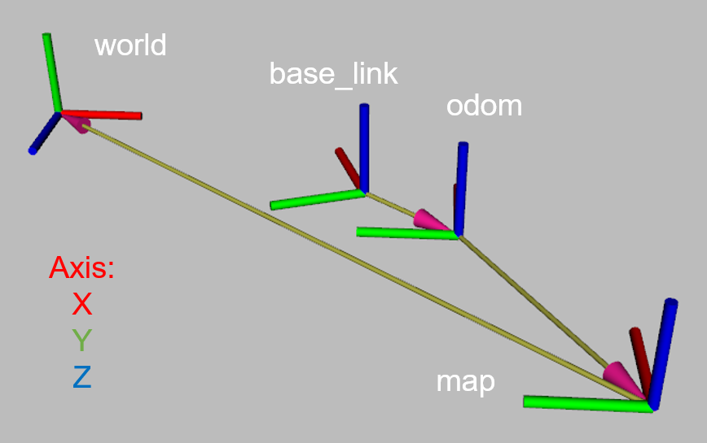

# The ROS topics and navigation system
<!-- # EP Carto Navigation Guide -->

# 1. Platform introduction

## 1.1 RoboMaster EP

<!-- https://dji-official-fe.djicdn.com/assets/uploads/v/b410280526a22148234b15b471186745.mp4 -->


<!-- [TODO] -->

the [RoboMaster EP](https://www.dji.com/cn/robomaster-ep) is an autonomous vehicle platform equipped with a 4 axis palletizing robot arm and an encircling gripper for flexible gripping action, which is inspired from DJI's annual RoboMaster robotics competition. 

It provides Mecanum wheel omnidirectional movement, fast wireless data link system including realtime video stream, and open sdk for further development and programming.

In order to match the theme of the competition, `sim2real`, the organizing committee equipped the RoboMaster EP with the external computing platform and other sensors communicates through the RoboMaster EP SDK with EP to realize the movement and grasping of the robot, complete the corresponding competition tasks, and is dedicated to connect the simulation environment with real applications.

<!-- ​RoboMaster EP是一款基于DJI RoboMaster比赛打造的教育机器人拓展套装，采用麦克纳姆轮实现敏捷的全向移动，MeArm构型的机械臂和环抱式夹爪实现灵活的抓取动作。为与赛会主题sim2real相契合，组委会外置运算平台和其他传感器，通过RoboMaster EP SDK和EP进行通信，实现机器人的移动和抓取，完成相应比赛任务，致力于将仿真环境与现实应用打通。 -->


The components of the RMUS EP


The hardware diagram of the RMUS EP

Additional to the original RoboMaster EP design, during the RUSM sim2real challenge we equipped the EP robot with dedicated onboard lidar, RGBD camera, to get further environment information and NUC PC to extending the online computation capacity.

<div class="okr-block-clipboard" data-okr="%7B%22okrDelta%22%3A%5B%7B%22lineType%22%3A%22unsupport%22%2C%22lineOptions%22%3A%7B%7D%2C%22lineContent%22%3A%5B%5D%7D%5D%2C%22businessKey%22%3A%22lark-doc%22%7D"></div><div data-zone-id="0" data-line-index="0" style="white-space: pre;">

Type | NUC11PAHI7
-- | --
CPU | i7-1165G7 2.8GHz * 8
RAM | 8GB
SSD | 256G
</div>

## 1.2 Sensors

<div data-zone-id="0" data-line-index="0" style="white-space: pre;">

Sensor | Type | Freq (SPS) | Others
-- | -- | -- | --
Lidar | [SlamTech Rplidar A2](https://www.slamtec.com/cn/Lidar/A2) | 10 | 8000sps, 0.2m-16m
RGB Camera | ​ [Intel Realsense D435i](https://www.intelrealsense.com/zh-hans/depth-camera-d435i/) | 30 | 640x480 pixels, FOV 87° x 58°
Depth Camera | ​ Intel Realsense D435i | 30 | 640x480 pixels,  FOV 87° x 58°
IMU | [HiPNUC Hi226 6-axis IMU/VRU](https://www.hipnuc.com/product_hi226.html) | 30 | Static roll and pitch errors: 0.8° <br>Static roll and pitch angles, error bound: 2.5° <br>bias error of gyroscope: < 10°/h <br>Heading angle error when moving (under 6-axis mode): < 10°
Odometer | [RoboMaster SDK](https://github.com/dji-sdk/robomaster-sdk) | 10 | -

</div>

<!-- ### 1.2.1 Lidar
​
[Rplidar A2](https://www.slamtec.com/en/Lidar/A2)

- Scan Rate:        12hz
- Sample Rate:      16000 times per second	
- Distance Range:   10~25 meter
- Minimum Operating ranging:    0.2m

### 1.2.2 IMU
​
### 1.2.3 Camera
​
[Intel Realsense D435i](https://www.intelrealsense.com/depth-camera-d435i/)

### 1.2.4 Main Controller from DJI (odometer) -->

## 1.3 Actuators

<div style="white-space: pre;" data-line-index="0" data-zone-id="0">

Actuator | Recommend Range
-- | --
chassis velocity control | $0.1m/s\leq\|v_x\|\leq0.5m/s$ <br>$0.1m/s\leq\|v_y\|\leq0.5m/s$ <br>$0.01rad/s\leq\|v_{th}\|\leq0.5rad/s$
chassis position control | $\|x\| \geq 0.1m$ <br>$\|y\| \geq 0.1m$ <br>$\|theta\| \geq 0.1rad$
arm end position control | while $0.09\leq x \leq 0.18$, should keep $y\ge 0.08$ <br>while $x>0.18$, should keep $y\ge -0.02$
gripper control | $x=1$ close gripper <br>$x=0$ open gripper

</div></div>

## 1.4 Robot Model

Tto build the static TF tree, according to the specific location of each sensors, the location of the discription file is here: 

`~/ep_ws/src/ep_description/urdf/ep_description.xacro`

The user should test the development in the `client` image at first,
<!-- 选手在实际开发过程中需要先在client镜像中先运行 -->

```bash
# static tf
$ roslaunch ep_descreption ep_description.launch
```

or include the part below in the `launch` file: 
<!-- 或者在launch文件中包含以下代码段即可 -->

```xml
<launch>
...
  <!-- ep_description -->
  <include file="$(find ep_description)/launch/ep_description.launch"/>
...
</launch>
```

<!-- # 2. Hardware interface -->


EP Robot tf_tree


Robot frame Axis

<div data-zone-id="0" data-line-index="0" style="white-space: pre;">

Coordinate system | Description | Origin according to `/base_link` (m)
-- | -- | --
`/base_link` | The robot center coordinate system is located at the center of the four Mecanum wheels, <br>and the height is on the plane where the centers of the four Mecanum wheels are located. | X Front Y Left Z Upper
`/laser_link` | Lidar coordinate | (0.12, 0, 0.1)
`/imu_link` | IMU coordinate | (0, 0, 0.08)
`/arm_link` | The base coordinate system of the robot arm | (0, 0, 0.1)
`/camera_bottom_screw_frame` | Realsense camera base screw positioning hole coordinate system, <br>as the standard for other coordinate systems of the camera | (0.15, 0, 0.0125)
`/camera_link` | Realsense camera coodinate | (0.16, 0.0175, 0.025)
`/camera_depth_frame` | Depth coordinate of Realsense camera, sharing the same space with`/camera_link` | (0.16, 0.0175, 0.025)
`/camera_color_frame` | RGB coordinate of Realsense camera | (0.16, 0.0325, 0.025)
`/camera_aligned_depth_to_color_frame` | the coordinate of Realsense Depth image aligned to RGB coordinate, <br>sharing the same space with `/camera_color_frame` | (0.16, 0.0325, 0.025)

</div>

`/base_link`

​Robot center coordinate system, located at the center point of the 4 Mecanum wheel.

`/imu_link`

​IMU coordinate system, the same as `base_link`.

`/laser_link`

​2D LiDAR coordinate system, located at the centrer front of the vehicle.

# 2. ROS interface

The RoboMaster EP platform environment is the same as the docker provided to players, sharing the same ROS interface.

Enter the docker setup from [Install guide](./docker_sim2real/sim2real-install-guide.md), using the `rostopic` command from the cli:

`sim2real@Ubuntu:~$ rostopic list -v`

All the Published/Subscribed Topics is printed:

Published topics:
 * /rosout_agg [rosgraph_msgs/Log] 1 publisher
 * /rosout [rosgraph_msgs/Log] 7 publishers
 * /cmd_vel [geometry_msgs/Twist] 1 publisher
 * /arm_position [geometry_msgs/Pose] 1 publisher
 * /arm_gripper [geometry_msgs/Point] 1 publisher
 * /image_view_rgb/parameter_descriptions [dynamic_reconfigure/ConfigDescription] 1 publisher
 * /image_view_third/parameter_descriptions [dynamic_reconfigure/ConfigDescription] 1 publisher
 * /image_view_depth/parameter_descriptions [dynamic_reconfigure/ConfigDescription] 1 publisher
 * /image_view_rgb/parameter_updates [dynamic_reconfigure/Config] 1 publisher
 * /image_view_third/parameter_updates [dynamic_reconfigure/Config] 1 publisher
 * /image_view_depth/parameter_updates [dynamic_reconfigure/Config] 1 publisher
 * /image_view_depth/output [sensor_msgs/Image] 1 publisher
 * /image_view_third/output [sensor_msgs/Image] 1 publisher
 * /image_view_rgb/output [sensor_msgs/Image] 1 publisher
 * /camera/color/image_raw [sensor_msgs/Image] 1 publisher
 * /third_rgb [sensor_msgs/Image] 1 publisher
 * /camera/color/camera_info [sensor_msgs/CameraInfo] 1 publisher
 * /camera/aligned_depth_to_color/image_raw [sensor_msgs/Image] 1 publisher
 * /camera/aligned_depth_to_color/camera_info [sensor_msgs/CameraInfo] 1 publisher
 * /pointgoal_with_gps_compass [ros_x_habitat/PointGoalWithGPSCompass] 1 publisher
 * /gps [ros_x_habitat/PointGoalWithGPSCompass] 1 publisher
 * /imu/data_raw [sensor_msgs/Imu] 1 publisher
 * /tf [tf2_msgs/TFMessage] 1 publisher
 * /rplidar/scan [sensor_msgs/LaserScan] 1 publisher
 * /ep/odom [nav_msgs/Odometry] 1 publisher
 * /gripper_state [geometry_msgs/Point] 1 publisher
 * /pose/cube_1 [geometry_msgs/Pose] 1 publisher
 * /pose/cube_2 [geometry_msgs/Pose] 1 publisher
 * /pose/cube_3 [geometry_msgs/Pose] 1 publisher
 * /pose/cube_4 [geometry_msgs/Pose] 1 publisher
 * /pose/cube_5 [geometry_msgs/Pose] 1 publisher
 * /position/target_1 [geometry_msgs/Point] 1 publisher
 * /position/target_2 [geometry_msgs/Point] 1 publisher
 * /position/target_3 [geometry_msgs/Point] 1 publisher
 * /pose/ep_world [geometry_msgs/Pose] 1 publisher
 * /judgement/exchange_markers [std_msgs/String] 1 publisher
 * /judgement/markers_time [std_msgs/String] 1 publisher

Subscribed topics:
 * /rosout [rosgraph_msgs/Log] 1 subscriber
 * /camera/aligned_depth_to_color/image_raw [sensor_msgs/Image] 1 subscriber
 * /third_rgb [sensor_msgs/Image] 1 subscriber
 * /camera/color/image_raw [sensor_msgs/Image] 1 subscriber
 * /pointgoal_with_gps_compass [ros_x_habitat/PointGoalWithGPSCompass] 1 subscriber
 * /cmd_vel [geometry_msgs/Twist] 1 subscriber
 * /arm_gripper [geometry_msgs/Point] 1 subscriber
 * /arm_position [geometry_msgs/Pose] 1 subscriber
 * /cmd_position [geometry_msgs/Twist] 1 subscriber
 * /gps/goal [move_base_msgs/MoveBaseActionGoal] 1 subscriber

## 2.1 Sensor topics

`/ep/odom` (nav_msgs/Odometry) default: 30hz
<!-- 里程计数据，包含机器人位姿和速度信息，由大疆主控解算获得。 -->
Odometer data, including robot pose and speed information, are obtained by DJI master control.

`/rplidar/scan` (type: sensor_msgs/LaserScan, frame_id:laser_link) default: 10hz
<!-- 二维激光雷达扫描数据，包含场景扫描信息，由于机器人本体遮挡范围包括机器人正前方270°，由激光雷达采集获得。 -->
The two-dimensional lidar scanning data, including scene scanning information, is acquired by lidar because the occlusion range of the robot body includes 270° in front of the robot.

`/imu/data_raw` (sensor_msgs/LaserScan) default: 30hz
<!-- IMU传感器数据，包含旋转、速度和加速度信息，由IMU采集获得。 -->
IMU sensor data, including rotation, velocity, and acceleration information, are collected by the IMU.

`/camera/color/camera_info` type: [sensor_msgs/CameraInfo], frame_id: `camera_color_optical_frame`
<!-- RGB彩色图像相机内参信息。 -->
RGB color image camera intrinsic parameter information.

`/camera/color/image_raw` type: [sensor_msgs/Image], frame_id: `camera_color_optical_frame`
<!-- RGB彩色图像数据，由Realsense采集获得。 -->
RGB color image data, acquired by Realsense.

`/camera/aligned_depth_to_color/camera_info` type: [sensor_msgs/CameraInfo], frame_id: `camera_color_optical_frame`
<!-- Depth深度图像相机信息。 -->
Depth camera information.

`/camera/aligned_depth_to_color/image_raw` type: [sensor_msgs/Image], frame_id: `camera_color_optical_frame`
<!-- Depth深度图像数据，由Realsense采集获得并对齐到RGB彩色图像。 -->
Depth image data, acquired by Realsense and aligned to RGB color images.

Note: The Realsense camera provides more images to choose from. We chose the depth data aligned with the color image as the default depth data provided in the habitat server environment.

<!-- ## 2.2 Publish topics

`/ep/odom` [nav_msgs/Odometry] default: 10hz
​
Obtained by DJI master control solution, including robot pose and speed information.

`/rplidar/scan` [sensor_msgs/LaserScan] default: 12hz
​
Obtained by LiDAR settlement, including scene scanning information, the range includes 270° in front of the robot.

`/imu/data_raw` [sensor_msgs/LaserScan] default: 60hz
​
Obtained by the robot body/external IMU, including rotation, speed and acceleration information. -->

## 2.2 Actuator topics

`/cmd_vel` [geometry_msgs/Twist]

<!-- ​由EP机器人底盘执行的速度指令，推荐范围： -->
Velocity command for the EP chassis, recommend range:

<!-- 
 -->

$$0.1m/s\leq|v_x|\leq0.35m/s$$
$$0.1m/s\leq|v_y|\leq0.35m/s$$
$$0.1rad/s\leq|v_{th}|\leq0.5rad/s$$

`/cmd_position` [geometry_msgs/Twist]

Position command for the EP chassis, recommend range:

$$0.1m\leq|x|$$
$$0.1m\leq|y|$$
$$0.1rad\leq|theta|$$

```bash
# Move EP forward for 0.1m
$ rostopic pub -1 /cmd_position geometry_msgs/Twist "linear:
  x: 0.1
  y: 0.0
  z: 0.0
angular:
  x: 0.0
  y: 0.0
  z: 0.0"
```

`/arm_position` [geometry_msgs/Pose]

Position control command for the Robotic arm, available range:

- While $0.09\leq x \leq 0.18$, recommendated $y\ge 0.08$
- While $x>0.18$, recommendated $y\ge -0.02$

Take care the inference of Lidar range and the robotic arm.

Command corresponding to `ee_link` of the robotic arm, the offerset of gripping position to `ee_link` is (0.11, -0.04)

```bash
# Move the end of the robotic arm to x=0.09, y=0.1
$ rostopic pub -1 /arm_position geometry_msgs/Pose "position:
  x: 0.09
  y: 0.1
  z: 0.0
orientation:
  x: 0.0
  y: 0.0
  z: 0.0
  w: 0.0"
```

`/arm_gripper` [geometry_msgs/Point]

The commands for gripper: 

- $x = 1$ to close
- $x = 0$ to open

```bash
# the command issued now is tp close the gripper
$ rostopic pub -1 /arm_gripper geometry_msgs/Point "x: 1.0
y: 0.0
z: 0.0" 
```

## 2.3 Others

### 2.3.1 Optional remote control

Both keyboard and the game controller supports provided in `carto_navigation` is available. In principle all XBOX 360 compatible controller could be used, to start the functionality:
<!-- 遥控功能已集成在3.1和3.2中的launch文件，如果需要单独启动或使用键盘遥控： -->

```bash
# Keyboard
$ rosrun teleop_twist_keyboard teleop_twist_keyboard.py
# Game controller
$ roslaunch carto_navigation joy_stick.launch
```

or include the part below in the `launch` file: 

```xml
<!-- Keyboard -->
  <include file="$(find carto_navigation)/launch/joy_stick.launch"/>
<!-- Game controller -->
  <node pkg="teleop_twist_keyboard" type="teleop_twist_keyboard.py" name="teleop_twist_keyboard_node" output="screen"/>
```

the keyboard functionality described as below:
- Press `i`， `j`， `，` ， `l`， to control forward/backward/rotation.
- Press `I`， `J`， `<`， `L`， to control the horizontal movement.
- Press `k`, stop the robot moving.
- Press `1`, to move the robotic arm upper.
- Press `2`， to move the robotic arm down.
- Press `3`， to close the gripper.
- Press `4`， to open the gripper.

the game controller functionality described as below:
- Press `a`, to move the robotic arm upper.
- Press `b`， to move the robotic arm down.
- Press `c`， to close the gripper.
- Press `d`， to open the gripper.

### 2.3.2 The position of ore
`/pose/cube_N` [geometry_msgs/Pose]

The mineral ore numbered with `N` start from 1 to 5, e.g. `/pose/cube_1` according to the place information of ore 1:

```bash
$ rostopic echo /position/cube_1

# the output:
# position: 
#   x: 1.0000563859939575
#   y: 0.09999138861894608
#   z: 3.400020122528076
# orientation: 
#   x: 0.00039166660280898213
#   y: -2.329996641492471e-05
#   z: -0.0011298519093543291
#   w: 0.9999992847442627
```

### 2.3.3 The location of Exchange Station

`/position/target_N` [geometry_msgs/Point]

<!-- N为兑换站编号，从左到右依次为1，2，3，e.g. /position/target_1 为最左侧兑换站位置： -->
The Exchange Station numbered with `N`, ordering from left to right as 1/2/3. e.g. `/pose/target_1` according to the place information of the leftmost Exchange Station:

```bash
$ rostopic echo /position/target_1

# the output:
# x: 2.325000047683716
# y: 0.085
# z: 1.8200000524520874
```

### 2.3.4 The location of Exchange Station

`/judgement/exchange_markers` [std_msgs/String]
`/judgement/markers_time` [std_msgs/String]

`/judgement/exchange_markers` is the topic to broadcast the marker digits for the exchange station, in the format below:

```bash
$ rostopic echo judgement/exchange_markers
data: "3, 5, 2"
---
data: "3, 5, 2"
---
```

`/judgement/markers_time` is the topic to broadcast the successful time to place the mineral ore in the right exchange station. There are 4 states for each exchange station:

1. `⁣NaN`, Wait for the client
2. `0.0`, client EP robot moved, the markers timer started 
3. `float`, Markers 
4. `None`, foul, you hit the exchange station, the marker(s) that you didn't put the right ore will no longer been recorded.

An example is as below:

```bash
$ rostopic echo judgement/markers_time
data: "nan, nan, nan"
---
data: "nan, nan, nan"
---
data: "nan, nan, nan"
---

...

data: "0, 0, 0"
---
data: "0, 0, 0"
---
data: "0, 0, 0"
---

...

data: "0, 0, 102.366459608078"
---
data: "0, 0, 102.366459608078"
---
data: "0, 0, 102.366459608078"
---

...

data: "0, None, 102.366459608078"
---
data: "0, None, 102.366459608078"
---
data: "0, None, 102.366459608078"
---
```

# 3 the Challenge field


<!-- 包含仿真环境坐标系（world)、地图坐标系（map）、里程计坐标系（odom），仿真环境基坐标系（world），仿真环境中机器人初始位置（initial pose）位置如图所示，具体位置关系为(4.2, 0, 3.5)。 -->
Including the simulation coordinate system (world), map coordinate system (map), odometer coordinate system (odom), the initial pose of the robot in simulation (initial pose), the specific location is `(4.2, 0, 3.5)`.

# 4. Tutorial for instance

## 4.0 Enter the docker

### 4.0.1 Docker image for habitat simulator

```bash
# start Habitat simulator docker image for the first time
$ cd docker_habitat
$ ./create_container.sh
$ ./exec.sh
```

<!-- 再次启动镜像，无需执行create_container_client.sh脚本，否则会丢失所有对镜像的修改， -->
Start the image again. 

Note **Do Not** executing the `create_container_client.sh` script, otherwise all modifications to the image will be lost:

```bash
# Firstly
$ sudo docker ps -a #get the current [container ID]
$ sudo docker start [container_ID]
# after the container started
$ cd docker_habitat
$ ./exec_.sh
```

<!-- 选手算法运行环境镜像sim2real -->
### 4.0.2 Algorithm environment for users

```bash
# start Habitat simulator docker image for the first time
$ cd docker_sim2real
$ ./create_container_client.sh
$ ./exec_client.sh
```

<!-- 再次启动镜像，无需执行create_container_client.sh脚本，否则会丢失所有对镜像的修改， -->
Start the image again. 
<!-- [TODO] -->
Note **Do Not** executing the `create_container_client.sh` script, otherwise all modifications to the image will be lost:

```bash
# Firstly
$ sudo docker ps -a #get the current [container ID]
$ sudo docker start container_ID
# after the container started
$ cd docker_sim2real
$ ./exec_client.sh
```

## 4.1 Map based on cartographer

```bash
$ roslaunch carto_navigation mapping_sim.launch
```

Config files located at `~/ep_ws/src/carto_navigation/param/` as `cartographer.lua` and `cartographer_localization.lua`.While the map finished, save the map and run:

```bash
$ ~/ep_ws/src/carto_navigation/launch/map_writer.sh
```

Defaultly, the map saved here: `~/ep_ws/src/carto_navigation/maps/`

## 4.2 Lider navigation based on `cartographer` and `move_base`

```bash
$ roslaunch carto_navigation navigation_sim.launch
```
<!-- 
可在`~/ep_ws/src/carto_navigation/launch/`目录中的`move_base.launch`修改使用的规划器（`dwa/teb`）,配置文件分别位于`~/ep_ws/src/carto_navigation/param/`中相应名字的目录中。 -->

The used planner (`dwa/teb`) can be modified in `move_base.launch` in the `~/ep_ws/src/carto_navigation/launch/` directory, and the configuration files are located in `~/ep_ws/src/carto_navigation/param/ ` in the directory with the corresponding name.

<!-- 基于cartographer的激光雷达导航完整的tf树如下图所示 -->
The complete `tf tree` of lidar navigation based on `cartographer` is shown in the figure below:


<!-- 包含仿真环境坐标系（world）地图坐标系（map）、里程计坐标系（odom），同时隐藏了机器人传感器坐标系（laser_link和imu_link）的图示。 -->

Contains the simulation environment coordinate system `world`, the map coordinate system `map`, the odometer coordinate system `odom`, and hides the icons of the robot sensor coordinate system (`laser_link` and `imu_link`).



# 5. Others

<!-- ## 4.1 launch文件中涉及环境变量的部分 -->
## 5.1 Environment variables related to `ENV_ROBOT_MODE` in launch files
​
<!-- 选手请勿更改此部分，镜像中已针对仿真和现实做出了区别处理。 -->
Players **should not** change this part, the docker image has made a distinction between simulation and reality.

## 5.2 Remap for the right topics
​
In order to make the Topic express its meaning more clearly, while avoiding the conflict of the same type of data from different sensors, topics such as `/rplidar/scan`, `/ep/odom` are used instead of the common `/scan`, `/odom` `, please use in the launch file tags to remap topics.
